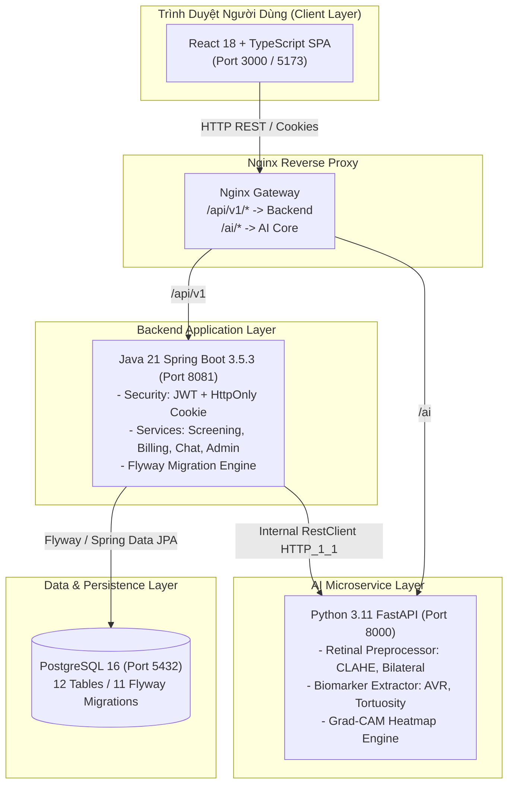
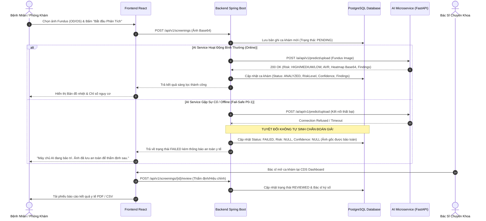

# TÀI LIỆU BÀN GIAO TOÀN DIỆN DỰ ÁN AURA
## (AURA System for Retinal Vascular Health Screening - Project Handover Document)

---

**Dự án**: AURA - Retinal Vascular Health Screening System  
**Ngày bàn giao**: 01/09/2026  
**Phiên bản bàn giao**: `v1.0.0-Baseline`  
**Căn cứ tài liệu**: 
- [SRS - Software Requirements Specification](file:///d:/VERSIONPLUS/AURA-System-for-Retinal-Vascular-Health-Screening/docs/01-requirements/software-requirements-specification.md) (Chuẩn IEEE 830-1998, căn cứ `DEBAI.pdf`)
- [AUDIT_REPORT.md](file:///d:/VERSIONPLUS/AURA-System-for-Retinal-Vascular-Health-Screening/AUDIT_REPORT.md) (Báo cáo Nghiệm thu Hiện trạng Kỹ thuật 39 FR / 23 NFR)
- [WORKLOG_2026-08-31.md](file:///d:/VERSIONPLUS/AURA-System-for-Retinal-Vascular-Health-Screening/WORKLOG_2026-08-31.md) (Nhật ký thực thi & khắc phục An toàn Y khoa P0-1)

---

## MỤC LỤC

1. [I. TỔNG QUAN HỆ THỐNG](#i-tổng-quan-hệ-thống)
2. [II. HƯỚNG DẪN CÀI ĐẶT & KHỞI CHẠY (ZERO-TO-ONE SETUP)](#ii-hướng-dẫn-cài-đặt--khởi-chạy-zero-to-one-setup)
3. [III. DANH SÁCH TÀI KHOẢN MẪU & PHÂN QUYỀN](#iii-danh-sách-tài-khoản-mẫu--phân-quyền)
4. [IV. KIẾN TRÚC HỆ THỐNG & LUỒNG DỮ LIỆU](#iv-kiến-trúc-hệ-thống--luồng-dữ-liệu)
5. [V. CƠ SỞ DỮ LIỆU & 11 FLYWAY MIGRATIONS](#v-cơ-sở-dữ-liệu--11-flyway-migrations)
6. [VI. ĐẶC TẢ API ENDPOINTS CHÍNH](#vi-đặc-tả-api-endpoints-chính)
7. [VII. BÁO CÁO NGHIỆM THU HIỆN TRẠNG CHỨC NĂNG](#vii-báo-cáo-nghiệm-thu-hiện-trạng-chức-năng)
8. [VIII. DANH MỤC CÔNG VIỆC DÀNH CHO ĐỘI NGŨ TIẾP QUẢN (NEXT STEPS)](#viii-danh-mục-công-việc-dành-cho-đội-ngũ-tiếp-quản-next-steps)
9. [IX. QUY TRÌNH CHẠY TEST SUITE & XÁC NHẬN CHẤT LƯỢNG](#ix-quy-trình-chạy-test-suite--xác-nhận-chất-lượng)

---

## I. TỔNG QUAN HỆ THỐNG

**AURA** là nền tảng web ứng dụng Trí tuệ Nhân tạo (AI/Deep Learning) hỗ trợ sàng lọc sớm các nguy cơ sức khỏe mạch máu thông qua phân tích hình ảnh đáy mắt (Fundus Camera).

### Các nhóm nguy cơ sàng lọc chính:
1. **Tim mạch (Cardiovascular Disease - CVD)**
2. **Đột quỵ (Stroke Risk)**
3. **Tăng huyết áp (Hypertension Retinopathy)**
4. **Bệnh võng mạc đái tháo đường (Diabetic Retinopathy)**

> ⚠️ **Nguyên tắc An toàn Y khoa Cốt lõi**:
> Hệ thống AURA là công cụ **hỗ trợ ra quyết định lâm sàng (Clinical Decision Support - CDS)** và **sàng lọc ban đầu**, không thay thế chẩn đoán hoặc chỉ định điều trị chính thức của Bác sĩ chuyên khoa Mắt. Khi AI gặp sự cố, hệ thống chuyển sang trạng thái an toàn `FAILED` và bảo toàn dữ liệu gốc, tuyệt đối không tự động sinh kết quả chẩn đoán giả.

### Stack Công nghệ Triển khai:
* **Frontend**: React 18, TypeScript, TailwindCSS, Lucide Icons, Vite 5, Nginx Reverse Proxy.
* **Backend**: Java 21, Spring Boot 3.5.3, Spring Security 6 (Stateless JWT + Rotating HttpOnly Cookie Refresh Token), Spring Data JPA, Flyway Migration.
* **AI Microservice**: Python 3.11, FastAPI, OpenCV, NumPy, PyTorch pipeline.
* **Cơ sở dữ liệu**: PostgreSQL 16 Alpine (12 bảng dữ liệu quản lý bởi 11 bản Flyway migrations).
* **Container Orchestration**: Docker & Docker Compose (4 services độc lập).

---

## II. HƯỚNG DẪN CÀI ĐẶT & KHỞI CHẠY (ZERO-TO-ONE SETUP)

### 1. Yêu cầu Môi trường:
* **Hệ điều hành**: Windows 10/11, macOS, hoặc Ubuntu Linux 22.04+.
* **Docker**: Docker Desktop 4.x+ và Docker Compose v2.
* *(Nếu chạy thủ công không dùng Docker)*:
  * Java OpenJDK 21 LTS
  * Node.js v18.x hoặc v20.x LTS + npm
  * Python 3.11+ + pip
  * PostgreSQL 16

---

### 2. Cách 1: Khởi chạy 1-Click bằng Launcher Script (Khuyên Dùng Trên Windows)
Trong thư mục gốc dự án, nhấp đúp hoặc chạy tệp [start-system.bat](file:///d:/VERSIONPLUS/AURA-System-for-Retinal-Vascular-Health-Screening/start-system.bat):

```cmd
start-system.bat
```
* Bấm phím **`[1]`**: Khởi chạy toàn bộ hệ thống bằng Docker Compose (4 containers).
* Bấm phím **`[3]`**: Khởi chạy đồng thời 3 dịch vụ cục bộ qua 3 cửa sổ Terminal riêng biệt.
* Bấm phím **`[2]`**: Dừng toàn bộ hệ thống.

---

### 3. Cách 2: Khởi chạy bằng Docker Compose

```bash
# 1. Điều hướng vào thư mục dự án
cd d:\VERSIONPLUS\AURA-System-for-Retinal-Vascular-Health-Screening

# 2. Build và khởi chạy toàn bộ 4 container ở chế độ nền
docker compose up --build -d

# 3. Kiểm tra trạng thái các container
docker compose ps
```

---

### 4. Cách 3: Khởi chạy Thủ công Từng Dịch vụ

#### Bước 2.1: Khởi động Database PostgreSQL
```bash
docker compose up -d aura-postgres
```

#### Bước 2.2: Khởi động AI Microservice (FastAPI - Port 8000)
```bash
cd ai-service
pip install -r requirements.txt
uvicorn app.main:app --host 0.0.0.0 --port 8000 --reload
```

#### Bước 2.3: Khởi động Backend (Spring Boot - Port 8081)
```bash
cd backend
# Windows:
.\mvnw.cmd spring-boot:run
# Linux/macOS:
./mvnw spring-boot:run
```

#### Bước 2.4: Khởi động Frontend Web (Vite - Port 5173 / 3000)
```bash
cd frontend
npm install
npm run dev
```

---

### 5. Bảng Tra cứu Cổng & URL Dịch vụ

| Dịch vụ | Địa chỉ URL Truy cập | Ghi chú & Tài liệu API |
| :--- | :--- | :--- |
| **Web Portal (Frontend)** | `http://localhost:3000` (Docker) hoặc `http://localhost:5173` (Dev) | Giao diện Single Page Application |
| **Backend REST API** | `http://localhost:8081/api/v1` | Spring Boot 3.5.3 REST Engine |
| **Backend Swagger UI** | `http://localhost:8081/swagger-ui.html` | Tài liệu OpenAPI tương tác |
| **AI Microservice Docs** | `http://localhost:8000/docs` | FastAPI Swagger / Redoc Docs |
| **PostgreSQL Database** | `localhost:5432` / DB: `aura_db` | User: `aura_user`, Pass: `aura_password` |

---

## III. DANH SÁCH TÀI KHOẢN MẪU & PHÂN QUYỀN

Hệ thống đã có sẵn 4 tài khoản mặc định đại diện cho 4 phân quyền (Role) chính trong file [seed_accounts.sql](file:///d:/VERSIONPLUS/AURA-System-for-Retinal-Vascular-Health-Screening/backend/src/main/resources/db/seed_accounts.sql):

| Phân hệ / Role | Email Đăng nhập | Mật khẩu | Phạm vi Giao diện & Chức năng |
| :--- | :--- | :--- | :--- |
| **Bệnh nhân (Patient / USER)** | `patient@aura.com` | `Password123@Aura` | Upload ảnh Fundus (OD/OS), xem kết quả nguy cơ, xem Heatmap, lịch sử khám, nạp credit, xuất PDF/CSV, chat với bác sĩ. |
| **Bác sĩ (Doctor / DOCTOR)** | `doctor@aura.com` | `Password123@Aura` | Bảng điều khiển CDS Dashboard, xem chỉ số vi mạch AVR/Tortuosity, duyệt/hiệu chỉnh mức nguy cơ, ghi chẩn đoán, chat tư vấn. |
| **Phòng khám (Clinic / CLINIC)** | `clinic@aura.com` | `Password123@Aura` | Cổng thông tin phòng khám, quản lý danh sách bác sĩ/bệnh nhân, upload batch ảnh hàng loạt. |
| **Quản trị viên (Admin / ADMIN)** | `admin@aura.com` | `Password123@Aura` | Quản lý người dùng, phân quyền, cấu hình hệ thống, xem Audit Logs bảo mật, quản lý phản hồi y tế. |

---

## IV. KIẾN TRÚC HỆ THỐNG & LUỒNG DỮ LIỆU

### 1. Sơ đồ Kiến trúc Tổng thể (System Architecture)



---

### 2. Luồng Sàng Lọc Y Tế (Screening Pipeline) & Cơ Chế Fail-safe P0-1



---

## V. CƠ SỞ DỮ LIỆU & 11 FLYWAY MIGRATIONS

Hệ thống sử dụng **Flyway** tự động khởi tạo và nâng cấp cấu trúc cơ sở dữ liệu trên PostgreSQL. Toàn bộ các script nằm trong thư mục `backend/src/main/resources/db/migration/`:

| Bản Migration | Tệp SQL | Mục đích & Nghiệp vụ |
| :--- | :--- | :--- |
| `V001` | [V001__create_roles_table.sql](file:///d:/VERSIONPLUS/AURA-System-for-Retinal-Vascular-Health-Screening/backend/src/main/resources/db/migration/V001__create_roles_table.sql) | Tạo bảng `roles` (Định nghĩa vai trò người dùng). |
| `V002` | [V002__create_users_table.sql](file:///d:/VERSIONPLUS/AURA-System-for-Retinal-Vascular-Health-Screening/backend/src/main/resources/db/migration/V002__create_users_table.sql) | Tạo bảng `users` (Lưu trữ thông tin tài khoản, mật khẩu băm BCrypt). |
| `V003` | [V003__create_user_roles_table.sql](file:///d:/VERSIONPLUS/AURA-System-for-Retinal-Vascular-Health-Screening/backend/src/main/resources/db/migration/V003__create_user_roles_table.sql) | Tạo bảng quan hệ nhiều-nhiều `user_roles`. |
| `V004` | [V004__seed_default_roles.sql](file:///d:/VERSIONPLUS/AURA-System-for-Retinal-Vascular-Health-Screening/backend/src/main/resources/db/migration/V004__seed_default_roles.sql) | Khởi tạo 3 vai trò mặc định: `USER`, `DOCTOR`, `ADMIN`. |
| `V005` | [V005__create_refresh_tokens_table.sql](file:///d:/VERSIONPLUS/AURA-System-for-Retinal-Vascular-Health-Screening/backend/src/main/resources/db/migration/V005__create_refresh_tokens_table.sql) | Tạo bảng `refresh_tokens` phục vụ cơ chế JWT Token Rotation an toàn. |
| `V006` | [V006__create_screenings_table.sql](file:///d:/VERSIONPLUS/AURA-System-for-Retinal-Vascular-Health-Screening/backend/src/main/resources/db/migration/V006__create_screenings_table.sql) | Tạo bảng `screenings` lưu trữ ca khám, ảnh đáy mắt, kết quả phân tích. |
| `V007` | [V007__seed_clinic_role.sql](file:///d:/VERSIONPLUS/AURA-System-for-Retinal-Vascular-Health-Screening/backend/src/main/resources/db/migration/V007__seed_clinic_role.sql) | Bổ sung vai trò `CLINIC` cho phân hệ Phòng khám. |
| `V008` | [V008__create_billing_tables.sql](file:///d:/VERSIONPLUS/AURA-System-for-Retinal-Vascular-Health-Screening/backend/src/main/resources/db/migration/V008__create_billing_tables.sql) | Tạo bảng `subscription`, `package_tier`, `payment_transaction` cho quản lý cước. |
| `V009` | [V009__create_audit_logs_and_feedback_tables.sql](file:///d:/VERSIONPLUS/AURA-System-for-Retinal-Vascular-Health-Screening/backend/src/main/resources/db/migration/V009__create_audit_logs_and_feedback_tables.sql) | Tạo bảng `audit_logs` (ghi nhật ký bảo mật) và `feedback` (ý kiến bác sĩ/người dùng). |
| `V010` | [V010__create_chat_messages_table.sql](file:///d:/VERSIONPLUS/AURA-System-for-Retinal-Vascular-Health-Screening/backend/src/main/resources/db/migration/V010__create_chat_messages_table.sql) | Tạo bảng `chat_messages` lưu trữ tin nhắn tư vấn 2 chiều giữa Bác sĩ và Bệnh nhân. |
| `V011` | [V011__add_failed_to_screening_status_check.sql](file:///d:/VERSIONPLUS/AURA-System-for-Retinal-Vascular-Health-Screening/backend/src/main/resources/db/migration/V011__add_failed_to_screening_status_check.sql) | Cập nhật Check Constraint: `CHECK (status IN ('PENDING', 'ANALYZED', 'REVIEWED', 'FAILED'))`. |

---

## VI. ĐẶC TẢ API ENDPOINTS CHÍNH

### 1. Phân hệ Xác thực & Người dùng (`/api/v1/auth`, `/api/v1/users`)
* `POST /api/v1/auth/register`: Đăng ký tài khoản Bệnh nhân mới.
* `POST /api/v1/auth/login`: Đăng nhập, nhận Access Token (30m) và Set-Cookie Refresh Token (7d).
* `POST /api/v1/auth/refresh`: Cấp mới Access Token bằng HttpOnly Cookie.
* `POST /api/v1/auth/logout`: Đăng xuất và thu hồi Refresh Token trong Database.
* `GET /api/v1/auth/me`: Lấy thông tin tài khoản hiện hành.

### 2. Phân hệ Sàng lọc Y tế (`/api/v1/screenings`)
* `POST /api/v1/screenings`: Tạo mới ca khám và gửi ảnh sang AI Microservice phân tích.
* `GET /api/v1/screenings`: Lấy danh sách ca khám (phân trang). Bệnh nhân chỉ xem ca của mình, Bác sĩ/Admin xem toàn bộ.
* `GET /api/v1/screenings/{id}`: Xem chi tiết một ca khám, ảnh gốc và kết quả.
* `POST /api/v1/screenings/{id}/review`: Bác sĩ gửi xác nhận, hiệu chỉnh mức rủi ro và ghi nhận chẩn đoán lâm sàng.

### 3. Phân hệ Tư vấn & Chat (`/api/v1/chat`)
* `POST /api/v1/chat/messages`: Gửi tin nhắn mới giữa Bệnh nhân và Bác sĩ.
* `GET /api/v1/chat/conversation/{otherUserId}`: Lấy toàn bộ lịch sử trò chuyện giữa 2 người dùng.
* `GET /api/v1/chat/unread-count`: Đếm số tin nhắn chưa đọc.
* `PUT /api/v1/chat/read/{senderId}`: Đánh dấu đã đọc tin nhắn.

### 4. Phân hệ Gói cước & Thanh toán (`/api/v1/me`)
* `GET /api/v1/me/subscriptions`: Xem số lượt khám (credits) còn lại của tài khoản.
* `POST /api/v1/me/packages/{id}/purchase`: Mua thêm gói lượt khám (Basic, Standard, Premium).
* `GET /api/v1/me/payments`: Xem lịch sử giao dịch và hóa đơn thanh toán.

### 5. Phân hệ Quản trị & Audit (`/api/v1/admin`, `/api/v1/audit-logs`, `/api/v1/feedback`)
* `GET /api/v1/admin/users`: Danh sách người dùng hệ thống kèm phân trang và lọc theo vai trò.
* `PUT /api/v1/admin/users/{id}/status`: Kích hoạt hoặc khóa tài khoản.
* `GET /api/v1/audit-logs`: Truy xuất nhật ký hành vi hệ thống (Đăng nhập, tạo ca khám, hiệu chỉnh y khoa).
* `POST /api/v1/feedback`: Gửi ý kiến phản hồi về hệ thống hoặc độ chính xác của AI.

### 6. Phân hệ AI Microservice (`/ai/api/v1/predict`)
* `POST /ai/api/v1/predict/upload`: Tiếp nhận ảnh Fundus, thực hiện tiền xử lý CLAHE, tính toán chỉ số AVR và sinh bản đồ nhiệt Base64.
* `GET /ai/health`: Kiểm tra sức khỏe của dịch vụ AI.

---

## VII. BÁO CÁO NGHIỆM THU HIỆN TRẠNG CHỨC NĂNG

Theo kết quả audit chi tiết tại [AUDIT_REPORT.md](file:///d:/VERSIONPLUS/AURA-System-for-Retinal-Vascular-Health-Screening/AUDIT_REPORT.md):

* **Yêu cầu Chức năng (39 FR)**:
  * **10 PASS (25.6%)**: Đăng nhập/Đăng ký JWT, Quản lý tài khoản, Tạo ca khám PostgreSQL thật, Xem lịch sử cá nhân, Xuất CSV, Quản lý gói cước & số dư, Xem Audit Log Admin, Khóa/Mở tài khoản, Phản hồi hệ thống, An toàn y tế P0-1.
  * **12 PARTIAL (30.8%)**: Upload ảnh mở rộng (thiếu DICOM), Xem chỉ số AVR, Thẩm định bác sĩ, Xuất báo cáo PDF, Chat in-app, Quản lý phòng khám, Dashboard thống kê, v.v.
  * **4 MOCK (10.3%)**: Cổng thanh toán mô phỏng, Grad-CAM Gaussian Blur (chưa nạp file `.pth`), Mock AI risk scores.
  * **10 UI ONLY (25.6%)**: Form sửa tiền sử bệnh chi tiết, Cấu hình Retraining AI, Quản lý quyền chi tiết, v.v.
  * **2 FAIL (5.1%)**: Chat thiếu phân công bác sĩ, Lỗ hổng IDOR chưa kiểm tra quyền sở hữu ca khám.
  * **1 MISSING (2.6%)**: Chưa tích hợp OAuth2 Google/Social.

---

## VIII. DANH MỤC CÔNG VIỆC DÀNH CHO ĐỘI NGŨ TIẾP QUẢN (NEXT STEPS)

Dưới đây là lộ trình các nhiệm vụ kỹ thuật ưu tiên cao nhất dành cho lập trình viên/đội ngũ tiếp quản:

### 🔴 Mức Ưu Tiên P0 (Bảo Mật & An Toàn Dữ Liệu Y Khoa)
1. **[P0-2] Khắc phục Lỗ hổng IDOR trên API Xem Ca Khám**:
   - *Vị trí*: [ScreeningController.java](file:///d:/VERSIONPLUS/AURA-System-for-Retinal-Vascular-Health-Screening/backend/src/main/java/com/aura/screening/controller/ScreeningController.java) (`GET /api/v1/screenings/{id}`).
   - *Yêu cầu*: Kiểm tra quyền sở hữu ca khám. Bệnh nhân chỉ được xem ca khám do chính mình tạo (`screening.getPatientId().equals(currentUser.getId())`). Bác sĩ/Admin được xem nếu có quyền phân công.
2. **[P0-3] Xây dựng Bảng Phân Công Bác Sĩ - Bệnh Nhân (`doctor_patient_assignments`)**:
   - *Yêu cầu*: Tạo migration `V012__create_doctor_patient_assignments_table.sql`. Chỉ cho phép Bác sĩ xem hồ sơ và nhắn tin với những Bệnh nhân được phân công tiếp nhận.
3. **[P0-4] Tách Riêng Bảng Kết Quả AI và Kết Quả Bác Sĩ Thẩm Định**:
   - *Vấn đề*: Hiện tại khi Bác sĩ review, giá trị `screenings.risk_level` bị ghi đè làm mất kết quả AI gốc.
   - *Yêu cầu*: Tạo bảng `doctor_reviews` riêng biệt lưu trữ: `original_ai_risk`, `doctor_risk`, `doctor_notes`, `reviewed_by`, `reviewed_at`.

### 🟡 Mức Ưu Tiên P1 (Tính Năng Nghiệp Vụ Chính)
1. **[P1-1] Tích Hợp Model PyTorch Weights Thực Tế**:
   - *Vị trí*: `ai-service/app/services/model_engine.py`.
   - *Yêu cầu*: Nạp tệp trọng số mạng nơ-ron `.pth` vào `ai-service/models/` và thay thế mặt nạ Gaussian Blur bằng thuật toán Grad-CAM trích xuất từ tầng Conv cuối cùng.
2. **[P1-2] Nâng Cấp Kênh Truyền Realtime Cho Tính Năng Chat**:
   - *Yêu cầu*: Tích hợp Spring WebSocket (STOMP) hoặc Server-Sent Events (SSE) để tin nhắn gửi nhận tức thì không cần tải lại trang.

---

## IX. QUY TRÌNH CHẠY TEST SUITE & XÁC NHẬN CHẤT LƯỢNG

### 1. Chạy Toàn Bộ Unit Test Backend (Spring Boot)
```bash
cd backend
# Chạy toàn bộ 33 unit tests
.\mvnw.cmd test
```
*Kết quả kỳ vọng*: **33/33 Tests PASS (0 Failures, 0 Errors)**.

### 2. Chạy Kiểm Thử AI Microservice Pipeline
```bash
cd ai-service
python test_predict.py
```
*Kết quả kỳ vọng*: `[OK] CLAHE Preprocessing`, `[OK] Grad-CAM Heatmap`, `[OK] AI Analysis passed!`.

### 3. Kiểm Tra Biên Dịch Frontend & TypeScript
```bash
cd frontend
npm run build
```
*Kết quả kỳ vọng*: `tsc -b && vite build` hoàn thành với **0 lỗi TypeScript**.

---

*(Tài liệu này được lập và đối chiếu theo nguyên tắc kỹ thuật chính xác, bảo toàn mã nguồn và sẵn sàng phục vụ công tác bàn giao dự án AURA).*
