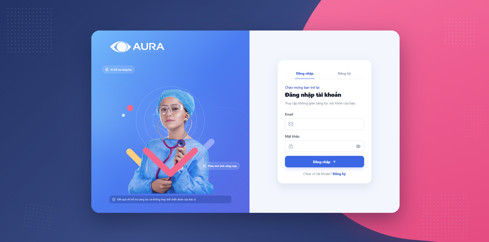

<div align="center">

<p align="center">
  
</p>

# AURA

### Hệ Thống Sàng Lọc Sức Khỏe Mạch Máu Võng Mạc

**AURA** là hệ thống hỗ trợ sàng lọc sức khỏe thông qua phân tích ảnh võng mạc bằng trí tuệ nhân tạo. Hệ thống hướng tới việc hỗ trợ người dùng và nhân viên y tế nhận biết sớm các dấu hiệu bất thường trên ảnh Fundus, quản lý lịch sử phân tích và theo dõi kết quả trên nền tảng web.

> **AURA là công cụ hỗ trợ quyết định và sàng lọc ban đầu, không thay thế chẩn đoán, kết luận hoặc chỉ định điều trị của bác sĩ.**

---

### 📚 TÀI LIỆU BÀN GIAO & KHẢO SÁT HỆ THỐNG
* 📋 **[HANDOVER.md](HANDOVER.md)**: **Tài liệu bàn giao chi tiết toàn diện** (Hướng dẫn cài đặt Zero-to-One, Tài khoản kiểm thử, Kiến trúc, 11 Migrations, API Endpoints, Checklist).
* 🔍 **[AUDIT_REPORT.md](AUDIT_REPORT.md)**: **Báo cáo Nghiệm thu Hiện trạng Kỹ thuật** đối chiếu 39 FR & 23 NFR theo chuẩn Đề bài.
* 📝 **[WORKLOG_2026-08-31.md](WORKLOG_2026-08-31.md)**: Nhật ký thực thi, sửa lỗi UI Modal & hoàn thành an toàn y khoa P0-1.
* 🚀 **[start-system.bat](start-system.bat)**: Trình khởi chạy 1-Click cho toàn bộ hệ thống (Docker Compose / Local Services).

</div>

---

## 1. Tổng quan dự án

Ảnh võng mạc có thể chứa nhiều thông tin liên quan đến tình trạng của mắt và hệ thống mạch máu. Tuy nhiên, việc đọc và đánh giá ảnh đòi hỏi kiến thức chuyên môn, thiết bị phù hợp và thời gian xử lý.

AURA được xây dựng nhằm tạo ra một nền tảng web cho phép:

- Tiếp nhận và quản lý ảnh võng mạc.
- Hỗ trợ phân tích ảnh bằng mô hình AI.
- Trả về kết quả dự đoán cùng độ tin cậy của mô hình.
- Minh họa vùng hình ảnh được AI chú ý.
- Lưu trữ lịch sử phân tích để theo dõi và đối chiếu.
- Hỗ trợ bác sĩ hoặc người có chuyên môn xem xét kết quả.
- Quản lý người dùng, vai trò và quyền truy cập trong hệ thống.

Dự án được phát triển theo kiến trúc tách biệt giữa giao diện người dùng, Backend nghiệp vụ và AI Service.

---

## 2. Mục tiêu

AURA hướng đến các mục tiêu chính:

1. Xây dựng nền tảng web hỗ trợ tải lên và quản lý ảnh võng mạc.
2. Ứng dụng Deep Learning để phân tích ảnh Fundus.
3. Hỗ trợ phát hiện hoặc phân loại một số dấu hiệu bất thường trên võng mạc.
4. Hiển thị xác suất dự đoán và mức độ tin cậy của mô hình.
5. Cung cấp hình ảnh giải thích như heatmap để hỗ trợ người dùng hiểu kết quả.
6. Lưu trữ kết quả phân tích và lịch sử xử lý.
7. Bảo vệ dữ liệu bằng cơ chế xác thực và phân quyền.
8. Thiết kế hệ thống có khả năng mở rộng thêm mô hình AI trong tương lai.

---

## 3. Phạm vi AI

Phiên bản AI thử nghiệm của dự án tập trung vào ảnh võng mạc và các nhóm phân loại như:

- Normal — Không phát hiện dấu hiệu thuộc các lớp mà mô hình đã được huấn luyện.
- Diabetic Retinopathy — Bệnh võng mạc do tiểu đường.
- Glaucoma — Dấu hiệu liên quan đến tăng nhãn áp.
- AMD — Thoái hóa điểm vàng do tuổi tác.

Kết quả từ mô hình AI chỉ mang tính chất hỗ trợ sàng lọc.

Ví dụ kết quả dự đoán:

```json
{
  "predictedClass": "DIABETIC_RETINOPATHY",
  "confidence": 0.82,
  "modelVersion": "fundus-model-v1",
  "status": "COMPLETED"
}
```

Giá trị `confidence` thể hiện mức độ tự tin của mô hình đối với kết quả dự đoán, không phải xác suất chắc chắn người dùng mắc bệnh.

---

## 4. Kiến trúc hệ thống

```text
┌─────────────────────────────┐
│       React Frontend        │
│     TypeScript + Vite       │
└──────────────┬──────────────┘
               │ REST API
               ▼
┌─────────────────────────────┐
│   Java Spring Boot Backend  │
│ Auth, User, Analysis, Admin │
└───────┬─────────────┬───────┘
        │             │
        │             │ Internal REST API
        ▼             ▼
┌───────────────┐  ┌──────────────────────┐
│  PostgreSQL   │  │ Python AI Service    │
│   Supabase    │  │ FastAPI + PyTorch    │
└───────────────┘  └──────────┬───────────┘
                              │
                              ▼
                   ┌──────────────────────┐
                   │ Retinal AI Model     │
                   │ Prediction + Heatmap │
                   └──────────────────────┘
```

### Luồng phân tích dự kiến

```text
Người dùng tải ảnh Fundus
        ↓
Frontend gửi ảnh đến Java Backend
        ↓
Backend xác thực và lưu thông tin ảnh
        ↓
Backend gửi yêu cầu đến Python AI Service
        ↓
AI tiền xử lý và chạy mô hình
        ↓
AI trả dự đoán, độ tin cậy và dữ liệu giải thích
        ↓
Backend lưu kết quả vào PostgreSQL
        ↓
Frontend hiển thị kết quả cho người dùng
```

Frontend không gọi trực tiếp AI Service. Java Backend đóng vai trò trung tâm trong việc xác thực, quản lý nghiệp vụ, lưu dữ liệu và điều phối yêu cầu phân tích.

---

## 5. Công nghệ sử dụng

| Thành phần | Công nghệ |
|---|---|
| Frontend | React, TypeScript, Vite, TailwindCSS |
| Backend | Java 21, Spring Boot 3 |
| Bảo mật | Spring Security, JWT |
| Database | Supabase PostgreSQL |
| Storage | Supabase Storage |
| AI Service | Python, FastAPI |
| AI Framework | PyTorch hoặc TensorFlow |
| Database Migration | Flyway |
| Backend Testing | JUnit, Mockito, Testcontainers |
| Containerization | Docker, Docker Desktop |
| Frontend Deployment | Vercel |
| Backend và AI Deployment | VPS, Render, Railway hoặc Cloud |

---

## 6. Chức năng hệ thống

### Chức năng đã xây dựng

- Đăng ký tài khoản bằng email và mật khẩu.
- Đăng nhập bằng email và mật khẩu.
- Xác thực bằng JWT access token.
- Refresh token được quản lý bằng HttpOnly cookie.
- Làm mới access token.
- Đăng xuất và thu hồi refresh token.
- Lấy thông tin người dùng đang đăng nhập.
- Phân quyền theo vai trò: `USER`, `DOCTOR`, `ADMIN`, `CLINIC`.
- Bàn làm việc Hỗ trợ Quyết định Lâm sàng (CDS Dashboard) cho Bác sĩ.
- Trình xem ảnh võng mạc tương tác Side-by-Side kèm bản đồ nhiệt (XAI Heatmap).
- Cổng quản lý chiến dịch sàng lọc hàng loạt (Clinic Batch Processing & Credit Quota).
- Nhật ký kiểm toán bảo mật (Admin Audit Logs & Security Trails).
- Cổng theo dõi sức khỏe và lịch sử tầm soát cho Bệnh nhân (Patient Portal).
- Health Check API.
- Validation dữ liệu đầu vào.
- Xử lý lỗi tập trung.
- Database migration bằng Flyway.
- Unit test và integration test cho chức năng backend.

---

## 7. API xác thực & hệ thống

| Method | Endpoint | Mô tả |
|---|---|---|
| `POST` | `/api/v1/auth/register` | Đăng ký tài khoản |
| `POST` | `/api/v1/auth/login` | Đăng nhập |
| `POST` | `/api/v1/auth/refresh` | Cấp access token mới |
| `POST` | `/api/v1/auth/logout` | Đăng xuất |
| `GET` | `/api/v1/auth/me` | Lấy thông tin người dùng hiện tại |
| `GET` | `/api/v1/system/health` | Kiểm tra trạng thái Backend |

---

## 8. Cấu trúc repository

```text
AURA-System-for-Retinal-Vascular-Health-Screening/
├── backend/                 # Java Spring Boot Backend
│   ├── src/
│   ├── pom.xml
│   ├── mvnw
│   └── mvnw.cmd
│
├── frontend/                # React + TypeScript Frontend
│   ├── public/
│   ├── src/
│   ├── package.json
│   └── vite.config.ts
│
├── ai-service/              # Python FastAPI AI Service
├── database/                # Tài liệu thiết kế cơ sở dữ liệu
├── infrastructure/          # Cấu hình triển khai hệ thống
├── docs/                    # Tài liệu yêu cầu, phân tích và kiến trúc
├── docker-compose.yml
├── .env.example
├── CONTRIBUTING.md
├── CHANGELOG.md
└── README.md
```

---

## 9. Chạy dự án

### Yêu cầu môi trường

- Java 21
- Node.js và npm
- Python 3.10 trở lên
- Docker Desktop
- PostgreSQL hoặc Supabase PostgreSQL
- Git

### Chạy Backend

```powershell
cd backend
.\mvnw.cmd spring-boot:run
```

Kiểm tra Backend:

```http
GET http://localhost:8081/api/v1/system/health
```

### Chạy Frontend

```powershell
cd frontend
npm install
npm run dev
```

Địa chỉ Frontend mặc định:

```text
http://localhost:5173
```

### Build Frontend

```powershell
cd frontend
npm run build
```

---

## 10. Biến môi trường

Sử dụng `.env.example` làm mẫu và tạo file `.env` riêng trên máy cá nhân:

```env
DB_URL=jdbc:postgresql://localhost:5432/aura_db
DB_USERNAME=postgres
DB_PASSWORD=your_secure_password

JWT_SECRET=your_jwt_secret_key_at_least_256_bits_length
JWT_ACCESS_EXPIRATION=900000
JWT_REFRESH_EXPIRATION=604800000

AI_SERVICE_BASE_URL=http://localhost:8000
FRONTEND_URL=http://localhost:5173
```

---

## 11. Nguyên tắc bảo mật

- Không commit `.env` chứa thông tin thật.
- Không lưu refresh token trong `localStorage`.
- Refresh token được quản lý bằng HttpOnly cookie.
- Mật khẩu phải được băm trước khi lưu vào database.
- Endpoint riêng tư phải yêu cầu JWT hợp lệ.
- Kiểm tra quyền truy cập dữ liệu theo người dùng và vai trò.
- Không công khai ảnh y tế hoặc kết quả phân tích.
- Không ghi dữ liệu nhạy cảm vào log.
- AI Service chỉ nên được Backend truy cập qua mạng nội bộ hoặc cơ chế xác thực service-to-service.

---

## 12. Trạng thái dự án

| Hạng mục | Trạng thái |
|---|---|
| Nền tảng Spring Boot Backend | Hoàn thành |
| Đăng ký và đăng nhập email | Hoàn thành |
| JWT và refresh token | Hoàn thành |
| Phân quyền đa vai trò (Doctor, Patient, Admin, Clinic) | Hoàn thành |
| Giao diện lâm sàng CDS Dashboard | Hoàn thành |
| Cổng Bệnh nhân & Cổng Phòng khám | Hoàn thành |
| Nhật ký kiểm toán Admin | Hoàn thành |
| Supabase PostgreSQL Migration | Hoàn thành |
| Upload & Xử lý hàng loạt | Đang hoàn thiện |
| AI Service Microservice | Đang phát triển |

---

## 13. Nguyên tắc sử dụng AI y tế

AURA không được sử dụng để tự động đưa ra chẩn đoán y khoa cuối cùng.

Kết quả AI phải luôn đi kèm cảnh báo:

> **Kết quả chỉ hỗ trợ sàng lọc và không thay thế chẩn đoán của bác sĩ.**

Mọi kết quả bất thường cần được bác sĩ hoặc người có chuyên môn xem xét lại.

---

## 14. Đóng góp

Xem hướng dẫn tại [`CONTRIBUTING.md`](CONTRIBUTING.md).

---

<div align="center">

### AURA

**AI-assisted Retinal Vascular Health Screening**

*Kết quả chỉ hỗ trợ sàng lọc và không thay thế chẩn đoán của bác sĩ.*

</div>
