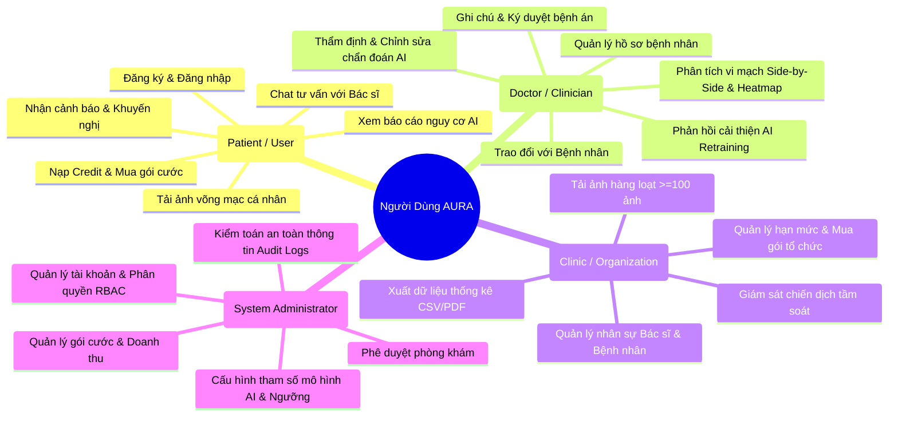

# TÀI LIỆU YÊU CẦU NGƯỜI DÙNG (USER REQUIREMENTS DOCUMENT)
## HỆ THỐNG SÀNG LỌC SỨC KHỎE MẠCH MÁU VÕNG MẠC (AURA)

*Mã tài liệu: `AURA-URD-01`*  
*Tiêu chuẩn áp dụng: ISO/IEC/IEEE 29148:2018 (Requirements Engineering)*  
*Căn cứ đề bài: `DEBAI.pdf` (Mục 1 & 2)*  

---

## 1. GIỚI THIỆU & BỐI CẢNH DỰ ÁN

### 1.1. Bối cảnh y tế dự phòng tại Việt Nam
Trong kỷ nguyên của y học dự phòng và chăm sóc sức khỏe cá nhân hóa, việc phát hiện sớm các nguy cơ sức khỏe hệ thống đã trở thành một yêu cầu thiết yếu. Nhiều bệnh lý mạn tính nguy hiểm như bệnh tim mạch (Cardiovascular Diseases - CVD), biến chứng võng mạc đái tháo đường (Diabetic Retinopathy - DR), và tăng huyết áp thường tiến triển âm thầm và chỉ bộc lộ triệu chứng khi đã ở giai đoạn muộn.

Tại Việt Nam, rào cản tiếp cận các phương pháp chẩn đoán chuyên sâu bao gồm chi phí cao, quy trình phức tạp và thiếu thốn đội ngũ bác sĩ chuyên khoa mắt/tim mạch tại tuyến y tế cơ sở.

### 1.2. Giải pháp Hệ thống AURA
AURA (**A**I **U**nderstanding **R**etinal **A**nalysis) là nền tảng Hỗ trợ Quyết định Lâm sàng (**Clinical Decision Support - CDS**) sử dụng hình ảnh chụp đáy mắt (Fundus Image) như một "cửa sổ không xâm lấn" để phân tích vi tuần hoàn mạch máu võng mạc, ước lượng nguy cơ bệnh lý hệ thống và hỗ trợ bác sĩ đưa ra quyết định nhanh chóng, chính xác.

---

## 2. CHÂN DUNG NGƯỜI DÙNG (USER PERSONAS) & MÔ HÌNH VAI TRÒ

---

## 3. DANH MỤC YÊU CẦU NGƯỜI DÙNG CHI TIẾT (USER STORIES)

### 3.1. Phân hệ Bệnh nhân (Patient / User)
- **US-01**: *Là một bệnh nhân*, tôi muốn đăng ký và đăng nhập an toàn bằng Email hoặc tài khoản liên kết để lưu trữ hồ sơ khám (`FR-1`).
- **US-02**: *Là một bệnh nhân*, tôi muốn tải lên ảnh chụp đáy mắt (Fundus hoặc OCT) với thao tác đơn giản (`FR-2`).
- **US-03**: *Là một bệnh nhân*, tôi muốn xem kết quả phân tích mức độ nguy cơ (Thấp, Trung bình, Cao) rõ ràng, dễ hiểu (`FR-3, FR-5`).
- **US-04**: *Là một bệnh nhân*, tôi muốn xem bản đồ nhiệt Grad-CAM thể hiện các vùng mạch máu bị tổn thương (`FR-4`).
- **US-05**: *Là một bệnh nhân*, tôi muốn tải về phiếu kết quả khám định dạng PDF chuẩn y khoa để lưu trữ hoặc mang đến bệnh viện (`FR-7`).
- **US-06**: *Là một bệnh nhân*, tôi muốn nhận thông báo tức thời khi AI hoàn thành phân tích (`FR-9`).
- **US-07**: *Là một bệnh nhân*, tôi muốn nhắn tin trực tiếp với Bác sĩ chuyên khoa để được tư vấn sức khỏe (`FR-10`).
- **US-08**: *Là một bệnh nhân*, tôi muốn nạp thêm lượt phân tích (Credit) hoặc mua gói cước linh hoạt (`FR-11, FR-12`).

### 3.2. Phân hệ Bác sĩ (Doctor)
- **US-09**: *Là một bác sĩ*, tôi muốn xem danh sách bệnh nhân được chỉ định cùng biểu đồ xu hướng lịch sử khám (`FR-13, FR-17, FR-18`).
- **US-10**: *Là một bác sĩ*, tôi muốn phân tích ảnh với công cụ chuyên sâu: Zoom/Pan, so sánh Side-by-Side và điều chỉnh độ mờ Heatmap (`FR-14`).
- **US-11**: *Là một bác sĩ*, tôi muốn xác nhận hoặc chỉnh sửa kết luận của AI trước khi trả kết quả cho bệnh nhân (`FR-15`).
- **US-12**: *Là một bác sĩ*, tôi muốn thêm chẩn đoán chuyên môn, đơn thuốc hoặc lời khuyên lâm sàng vào phiếu khám (`FR-16`).
- **US-13**: *Là một bác sĩ*, tôi muốn gửi phản hồi sai số của AI để làm dữ liệu mẫu huấn luyện lại mô hình (`FR-19`).
- **US-14**: *Là một bác sĩ*, tôi muốn trao đổi hai chiều với bệnh nhân qua cửa sổ tư vấn trực tuyến (`FR-20`).

### 3.3. Phân hệ Phòng khám (Clinic)
- **US-15**: *Là đại diện phòng khám*, tôi muốn đăng ký tài khoản tổ chức và quản lý danh sách bác sĩ thuộc cơ sở (`FR-22, FR-23`).
- **US-16**: *Là nhân viên kỹ thuật phòng khám*, tôi muốn tải lên hàng loạt ảnh ($\ge 100$ ảnh) theo lô cho chiến dịch khám cộng đồng (`FR-24`).
- **US-17**: *Là người quản lý phòng khám*, tôi muốn theo dõi báo cáo tổng hợp tỷ lệ rủi ro của toàn bộ chiến dịch (`FR-25, FR-26`).
- **US-18**: *Là người quản lý phòng khám*, tôi muốn nhận cảnh báo khẩn cấp khi có ca bệnh nguy cơ rất cao (`FR-29`).
- **US-19**: *Là chuyên viên nghiên cứu phòng khám*, tôi muốn xuất toàn bộ dữ liệu sàng lọc ra định dạng CSV để phân tích (`FR-30`).

### 3.4. Phân hệ Quản trị viên (Admin)
- **US-20**: *Là quản trị viên*, tôi muốn quản trị danh sách người dùng, kích hoạt/khóa tài khoản và duyệt phòng khám mới (`FR-31, FR-38`).
- **US-21**: *Là quản trị viên*, tôi muốn điều chỉnh ngưỡng nhạy cảm chẩn đoán (Sensitivity) và tham số AI mà không cần dừng hệ thống (`FR-33`).
- **US-22**: *Là quản trị viên*, tôi muốn quản lý bảng giá, gói dịch vụ và theo dõi doanh thu tổng thể (`FR-34, FR-35`).
- **US-23**: *Là quản trị viên*, tôi muốn tra cứu nhật ký kiểm toán (Audit Logs) để đảm bảo tuân thủ bảo mật y tế HIPAA (`FR-37`).

---

## 4. MA TRẬN TRUY VẾT YÊU CẦU NGƯỜI DÙNG (TRACEABILITY MATRIX)

| User Story | Mã FR tương ứng | Phân hệ (Actor) | Độ ưu tiên (MoSCoW) |
|---|---|---|---|
| US-01 | `FR-1` | Patient | Must Have |
| US-02 | `FR-2` | Patient | Must Have |
| US-03 | `FR-3, FR-5` | Patient | Must Have |
| US-04 | `FR-4` | Patient / Doctor | Must Have |
| US-05 | `FR-7` | Patient | Must Have |
| US-06 | `FR-9` | Patient | Should Have |
| US-07 | `FR-10` | Patient / Doctor | Should Have |
| US-08 | `FR-11, FR-12` | Patient / Clinic | Must Have |
| US-09 | `FR-13, FR-17, FR-18` | Doctor | Must Have |
| US-10 | `FR-14` | Doctor | Must Have |
| US-11 | `FR-15` | Doctor | Must Have |
| US-12 | `FR-16` | Doctor | Must Have |
| US-13 | `FR-19` | Doctor | Should Have |
| US-14 | `FR-20` | Doctor / Patient | Should Have |
| US-15 | `FR-22, FR-23` | Clinic / Admin | Must Have |
| US-16 | `FR-24` | Clinic | Must Have |
| US-17 | `FR-25, FR-26` | Clinic | Must Have |
| US-18 | `FR-29` | Clinic | Should Have |
| US-19 | `FR-30` | Clinic | Must Have |
| US-20 | `FR-31, FR-38` | Admin | Must Have |
| US-21 | `FR-33` | Admin | Should Have |
| US-22 | `FR-34, FR-35, FR-36` | Admin | Must Have |
| US-23 | `FR-37` | Admin | Must Have |
