# TÀI LIỆU THIẾT KẾ KIẾN TRÚC & THIẾT KẾ CHI TIẾT (ARCHITECTURE DESIGN DOCUMENT)
## HỆ THỐNG SÀNG LỌC SỨC KHỎE MẠCH MÁU VÕNG MẠC (AURA)

*Mã tài liệu: `AURA-ADD-03`*  
*Tiêu chuẩn thiết kế: Chuẩn mô hình hóa UML 2.0 & IEEE 1471 / ISO/IEC 42010*  
*Căn cứ đề bài: `DEBAI.pdf` (Mục 4.1 & 4.4)*  

---

## 1. TỔNG QUAN KIẾN TRÚC HỆ THỐNG (SYSTEM ARCHITECTURE)

Hệ thống AURA được xây dựng theo kiến trúc **Microservices phân tầng (Multi-tier Clean Architecture)**, đảm bảo tính phân tách độc lập giữa tầng giao diện người dùng, tầng xử lý nghiệp vụ & an ninh, tầng suy luận trí tuệ nhân tạo (AI Core) và tầng lưu trữ dữ liệu.

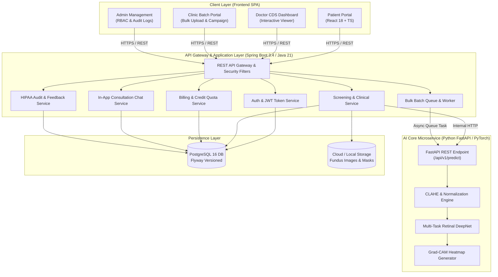

---

## 2. TỔNG HỢP 14 SƠ ĐỒ CHUẨN UML 2.0 (UML 2.0 DIAGRAMS SUITE)

### Sơ đồ 1: Biểu đồ Use Case Tổng quan Hệ thống (System Use Case Diagram)
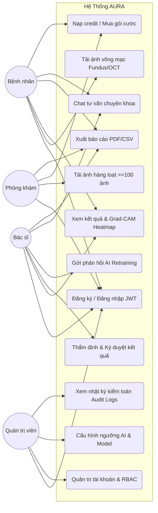

---

### Sơ đồ 2: Biểu đồ Use Case Phân hệ Bệnh nhân (Patient Use Case)
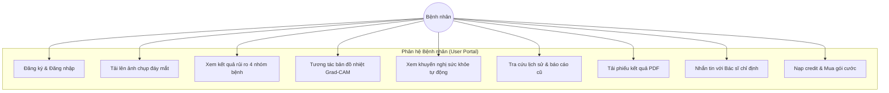

---

### Sơ đồ 3: Biểu đồ Use Case Phân hệ Bác sĩ (Doctor Use Case)
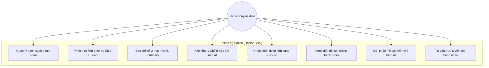

---

### Sơ đồ 4: Biểu đồ Use Case Phân hệ Phòng khám (Clinic Use Case)
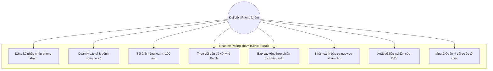

---

### Sơ đồ 5: Biểu đồ Use Case Phân hệ Quản trị viên (Admin Use Case)
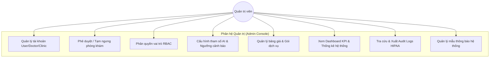

---

### Sơ đồ 6: Biểu đồ Hoạt động Sàng lọc Ảnh Đơn lẻ (Activity Diagram - Screening Workflow)
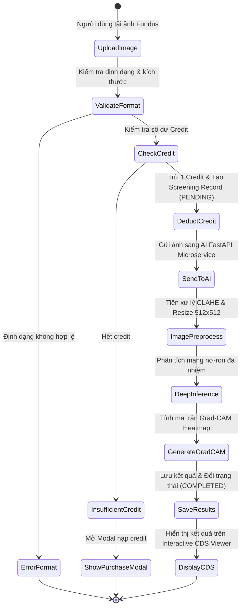

---

### Sơ đồ 7: Biểu đồ Hoạt động Xử lý Hàng loạt Ảnh (Activity Diagram - Bulk Batch Processing)
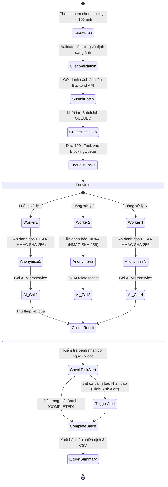

---

### Sơ đồ 8: Biểu đồ Hoạt động Bác sĩ Thẩm định & Tái Huấn Luyện AI (Doctor Validation Activity)
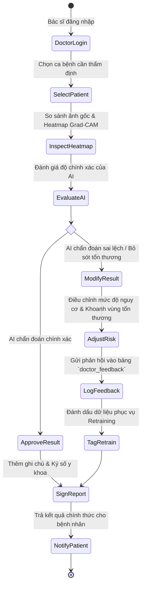

---

### Sơ đồ 9: Biểu đồ Tuần tự Xác thực & Xoay vòng Refresh Token (Sequence Diagram - Auth & JWT Rotation)
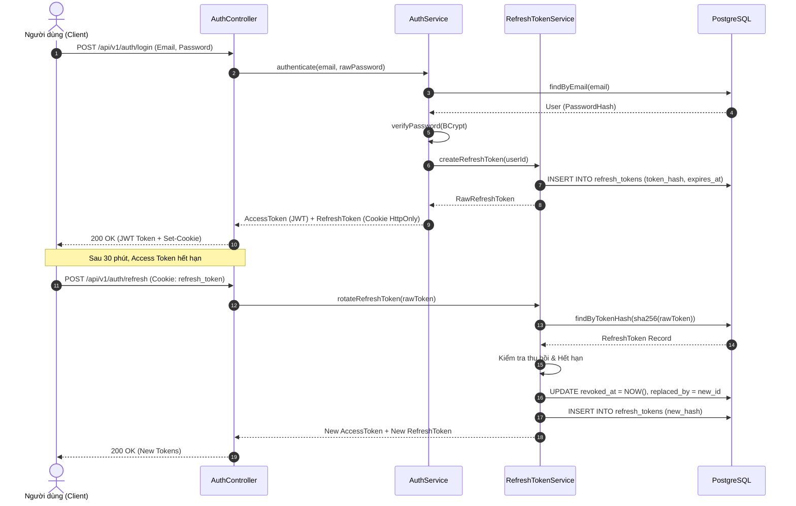

---

### Sơ đồ 10: Biểu đồ Tuần tự Suy luận AI & Grad-CAM (Sequence Diagram - AI Inference Pipeline)
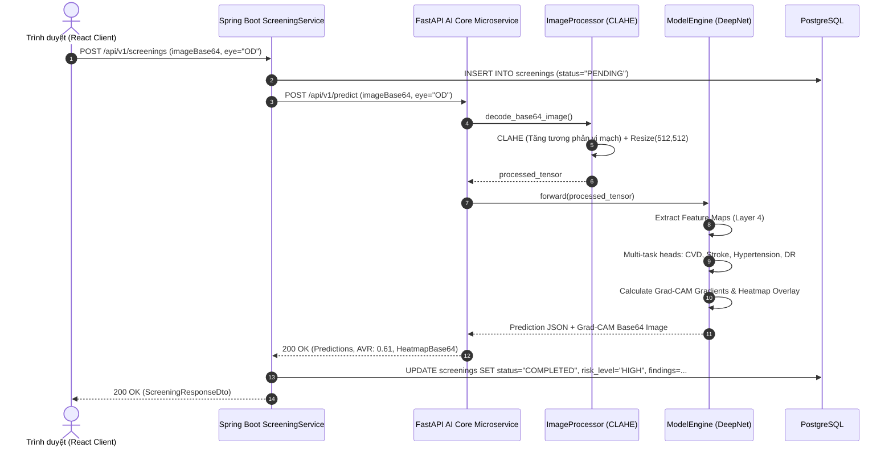

---

### Sơ đồ 11: Biểu đồ Tuần tự Chat Tư vấn Bác sĩ - Bệnh nhân (Sequence Diagram - In-App Chat)
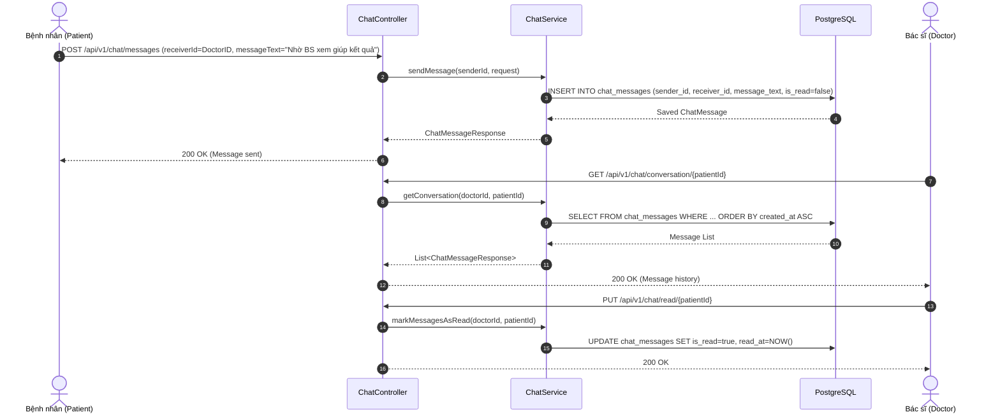

---

### Sơ đồ 12: Biểu đồ Lớp Thực thể Miền (Domain Class Diagram)
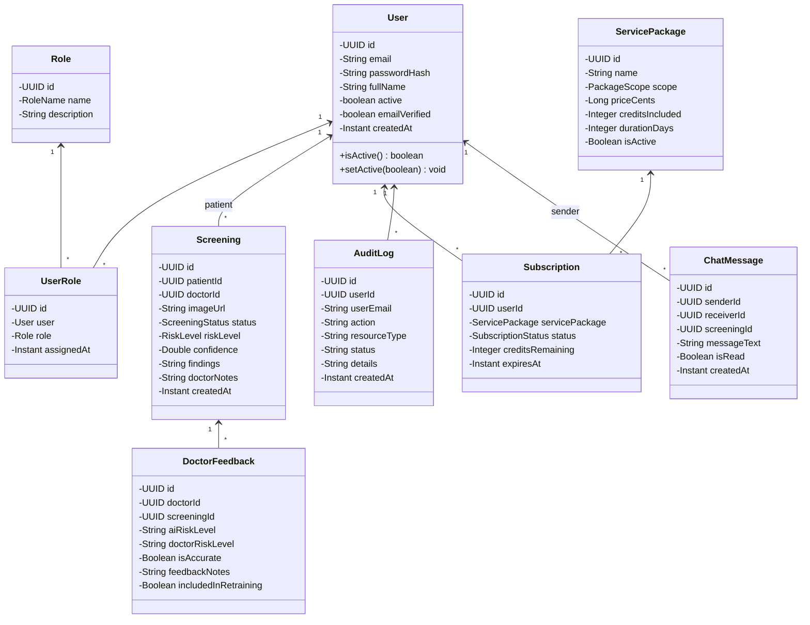

---

### Sơ đồ 13: Biểu đồ Trạng thái Ca Khám Sàng Lọc (Screening Lifecycle State Machine)
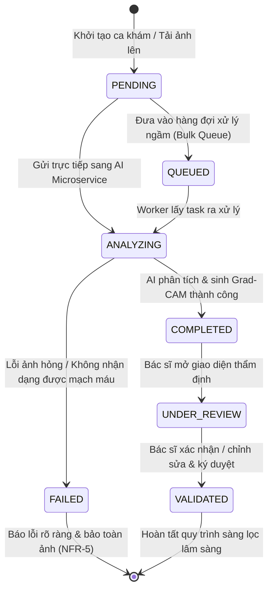

---

### Sơ đồ 14: Biểu đồ Triển khai Đa Container (Docker Deployment Diagram)
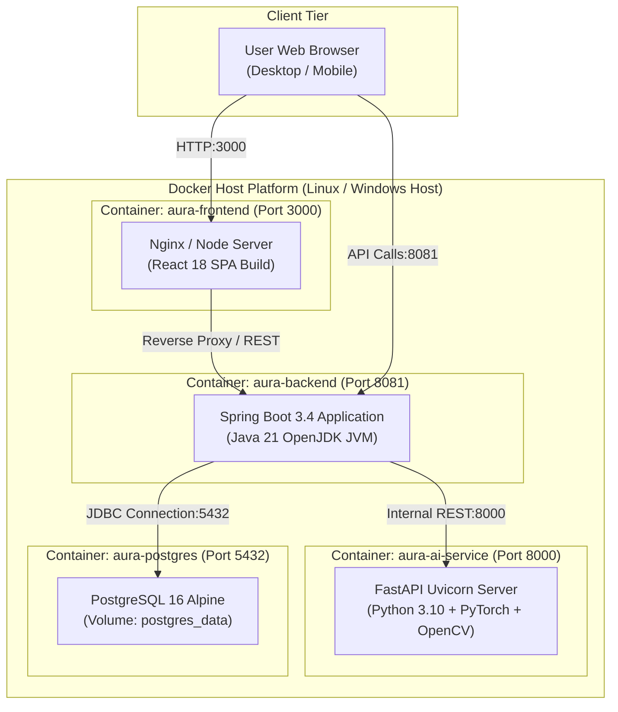
