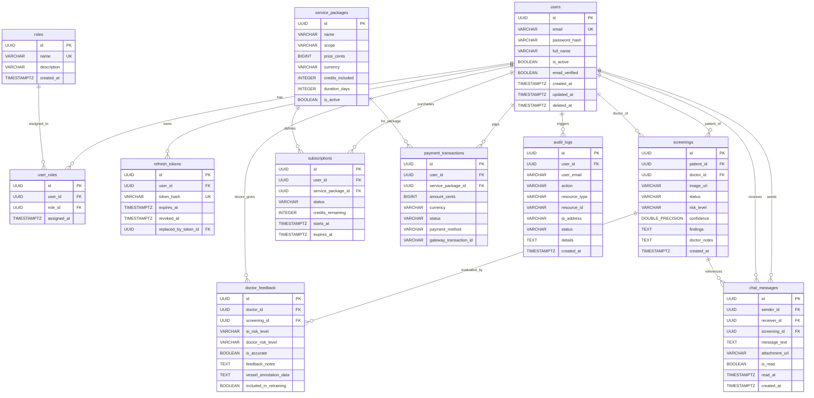

# TÀI LIỆU THIẾT KẾ CƠ SỞ DỮ LIỆU & TỪ ĐIỂN DỮ LIỆU (DATABASE DESIGN & DATA DICTIONARY)
## HỆ THỐNG SÀNG LỌC SỨC KHỎE MẠCH MÁU VÕNG MẠC (AURA)

*Mã tài liệu: `AURA-DBD-04`*  
*Hệ quản trị CSDL: PostgreSQL 16 (Relational Database)*  
*Cơ chế quản lý phiên bản: Flyway Database Migrations (V001 -> V010)*  
*Căn cứ đề bài: `DEBAI.pdf` (Mục 3.4 & 4.2)*  

---

## 1. SƠ ĐỒ QUAN HỆ THỰC THỂ (ENTITY RELATIONSHIP DIAGRAM - ERD)

---

## 2. TỪ ĐIỂN DỮ LIỆU CHI TIẾT (DATA DICTIONARY)

### 2.1. Bảng `users` (Tài khoản người dùng)
| Tên cột | Kiểu dữ liệu | Ràng buộc | Mô tả ý nghĩa |
|---|---|---|---|
| `id` | `UUID` | `PRIMARY KEY` | Khóa chính định danh người dùng duy nhất |
| `email` | `VARCHAR(320)` | `NOT NULL, UNIQUE` | Địa chỉ email đăng nhập chuẩn RFC 5322 |
| `password_hash` | `VARCHAR(255)` | `NOT NULL` | Chuỗi băm mật khẩu chuẩn BCrypt (Cost 12) |
| `full_name` | `VARCHAR(150)` | `NULLABLE` | Họ và tên đầy đủ của người dùng |
| `is_active` | `BOOLEAN` | `NOT NULL, DEFAULT TRUE` | Trạng thái kích hoạt tài khoản (`FR-31`) |
| `email_verified`| `BOOLEAN` | `NOT NULL, DEFAULT FALSE`| Trạng thái xác thực email |
| `created_at` | `TIMESTAMPTZ` | `NOT NULL, DEFAULT NOW()`| Thời điểm tạo tài khoản |
| `updated_at` | `TIMESTAMPTZ` | `NOT NULL, DEFAULT NOW()`| Thời điểm cập nhật thông tin |
| `deleted_at` | `TIMESTAMPTZ` | `NULLABLE` | Thời điểm xóa mềm (Soft Delete) |

### 2.2. Bảng `roles` & `user_roles` (Vai trò & Phân quyền RBAC)
- **`roles`**:
  - `id`: UUID (PK)
  - `name`: VARCHAR(50) NOT NULL UNIQUE (Gồm: `USER`, `DOCTOR`, `CLINIC`, `ADMIN`)
  - `description`: VARCHAR(255)
- **`user_roles`**:
  - `id`: UUID (PK)
  - `user_id`: UUID (FK references `users.id`)
  - `role_id`: UUID (FK references `roles.id`)
  - `assigned_at`: TIMESTAMPTZ (Thời điểm gán vai trò)

### 2.3. Bảng `screenings` (Hồ sơ ca khám sàng lọc)
| Tên cột | Kiểu dữ liệu | Ràng buộc | Mô tả ý nghĩa |
|---|---|---|---|
| `id` | `UUID` | `PRIMARY KEY` | Khóa chính của ca khám |
| `patient_id` | `UUID` | `NOT NULL, FK` | Khóa ngoại tham chiếu đến bệnh nhân (`users.id`) |
| `doctor_id` | `UUID` | `NULLABLE, FK` | Bác sĩ chuyên khoa được gán thẩm định |
| `image_url` | `VARCHAR(512)` | `NOT NULL` | Đường dẫn lưu trữ ảnh chụp đáy mắt |
| `status` | `VARCHAR(32)` | `NOT NULL` | `PENDING`, `ANALYZING`, `COMPLETED`, `VALIDATED` |
| `risk_level` | `VARCHAR(32)` | `NULLABLE` | `LOW`, `MODERATE`, `HIGH`, `CRITICAL` |
| `confidence` | `DOUBLE PRECISION`| `NULLABLE`| Điểm số độ tin cậy của AI (0.0 đến 1.0) |
| `findings` | `TEXT` | `NULLABLE` | JSON kết quả phân tích: AVR, Tortuosity, Nicking |
| `doctor_notes` | `TEXT` | `NULLABLE` | Ghi chú chẩn đoán lâm sàng của bác sĩ (`FR-16`) |
| `created_at` | `TIMESTAMPTZ` | `NOT NULL` | Thời điểm tạo ca khám |

### 2.4. Bảng `service_packages`, `subscriptions`, `payment_transactions`
- **`service_packages`**: Chứa thông tin các gói cước (`INDIVIDUAL`, `CLINIC`), giá cước (`price_cents`), số lượt phân tích (`credits_included`) và thời hạn (`duration_days`).
- **`subscriptions`**: Quản lý gói cước đang kích hoạt của từng tài khoản, hạn mức credit còn lại (`credits_remaining`) và ngày hết hạn (`expires_at`).
- **`payment_transactions`**: Lưu vết các giao dịch nạp tiền, phương thức thanh toán và mã giao dịch cổng thanh toán.

### 2.5. Bảng `audit_logs` (Nhật ký kiểm toán an toàn y tế HIPAA - NFR-10, NFR-18)
| Tên cột | Kiểu dữ liệu | Ràng buộc | Mô tả ý nghĩa |
|---|---|---|---|
| `id` | `UUID` | `PRIMARY KEY` | Khóa chính bản ghi kiểm toán |
| `user_id` | `UUID` | `NULLABLE, FK` | Người thực hiện hành vi |
| `user_email` | `VARCHAR(320)` | `NULLABLE` | Email người dùng |
| `action` | `VARCHAR(64)` | `NOT NULL` | `AUTH_LOGIN`, `PHI_VIEW`, `AI_PREDICT`, `STATUS_CHANGE` |
| `resource_type`| `VARCHAR(64)`| `NOT NULL` | `SCREENING`, `USER`, `BILLING`, `AI_CONFIG` |
| `ip_address` | `VARCHAR(45)` | `NULLABLE` | Địa chỉ IP Client (IPv4/IPv6) |
| `status` | `VARCHAR(32)` | `NOT NULL` | `SUCCESS`, `DENIED`, `FAILED` |
| `details` | `TEXT` | `NULLABLE` | Thông tin chi tiết hành vi |
| `created_at` | `TIMESTAMPTZ` | `NOT NULL` | Thời điểm phát sinh hành vi |

### 2.6. Bảng `doctor_feedback` & `chat_messages`
- **`doctor_feedback`**: Lưu trữ đánh giá của bác sĩ về kết quả AI, mức độ nguy cơ thực tế và cờ `included_in_retraining` phục vụ bài toán Retraining (`FR-19`).
- **`chat_messages`**: Lưu trữ các tin nhắn trao đổi hai chiều giữa Bệnh nhân và Bác sĩ, hỗ trợ đính kèm hình ảnh và đánh dấu đã đọc (`FR-10, FR-20`).

---

## 3. CHIẾN LƯỢC ĐÁNH CHỈ MỤC (INDEXING STRATEGY)
Để đảm bảo yêu cầu phi chức năng về thời gian truy xuất dưới 3 giây (`NFR-3`):
1. Đánh chỉ mục B-Tree trên các cột khóa ngoại: `idx_screenings_patient_id`, `idx_screenings_doctor_id`, `idx_subscriptions_user_id`.
2. Đánh chỉ mục trên trường thời gian phục vụ phân trang và xuất báo cáo: `idx_audit_logs_created_at`, `idx_chat_messages_created_at`.
3. Đánh chỉ mục trên trường trạng thái phục vụ lọc hàng đợi: `idx_screenings_status`, `idx_payment_transactions_status`.
