# KẾ HOẠCH THỰC HIỆN VÀ HOÀN THIỆN ĐỒ ÁN TOÀN DIỆN
## HỆ THỐNG SÀNG LỌC SỨC KHỎE MẠCH MÁU VÕNG MẠC (AURA)

*Căn cứ theo Đề cương và Yêu cầu Đồ án (`DEBAI.pdf`)*  
*Thời gian lập: Tháng 08/2026*  
*Đơn vị thực hiện: Nhóm phát triển AURA (7 thành viên)*

---

## MỤC LỤC
1. [Tổng Quan Đồ Án & Ma Trận Yêu Cầu](#1-tổng-quan-đồ-án--ma-trận-yêu-cầu)
2. [Đánh Giá Hiện Trạng & Phân Tích Khoảng Cách (Gap Analysis)](#2-đánh-giá-hiện-trạng--phân-tích-khoảng-cách-gap-analysis)
3. [Phân Rã 5 Gói Công Việc Chi Tiết (Work Breakdown Structure - WBS)](#3-phân-rã-5-gói-công-việc-chi-tiết-work-breakdown-structure---wbs)
   - [Gói 1: Thiết Kế & Hoàn Thiện Giao Diện Web (UI/UX)](#gói-nhiệm-vụ-1-thiết-kế--hoàn-thiện-giao-diện-web-uiux)
   - [Gói 2: Phát Triển Hệ Thống API & Cơ Sở Dữ Liệu (Backend)](#gói-nhiệm-vụ-2-phát-triển-hệ-thống-api--cơ-sở-dữ-liệu-backend)
   - [Gói 3: Xây Dựng AI Core Microservice (Python FastAPI)](#gói-nhiệm-vụ-3-xây-dựng-ai-core-microservice-python-fastapi)
   - [Gói 4: Đóng Gói, Triển Khai & Kiểm Thử Hệ Thống (DevOps & QA)](#gói-nhiệm-vụ-4-đóng-gói-triển-khai--kiểm-thử-hệ-thống-devops--qa)
   - [Gói 5: Soạn Thảo Bộ 7 Tài Liệu Bắt Buộc (Chuẩn UML 2.0)](#gói-nhiệm-vụ-5-soạn-thảo-bộ-7-tài-liệu-bắt-buộc-chuẩn-uml-20)
4. [Lịch Trình Triển Khai & Phân Công Nhiệm Vụ (Timeline & Sprints)](#4-lịch-trình-triển-khai--phân-công-nhiệm-vụ-timeline--sprints)
5. [Tiêu Chí Nghiệm Thu & Danh Mục Chuẩn Bị Bảo Vệ (Viva Defense Checklist)](#5-tiêu-chí-nghiệm-thu--danh-mục-chuẩn-bị-bảo-vệ-viva-defense-checklist)

---

## 1. TỔNG QUAN ĐỒ ÁN & MA TRẬN YÊU CẦU

### 1.1. Mục tiêu cốt lõi
Xây dựng nền tảng **Hỗ trợ Quyết định Lâm sàng (Clinical Decision Support - CDS)** phục vụ sàng lọc sớm các bệnh lý tim mạch, tiểu đường và bất thường đáy mắt thông qua ảnh chụp võng mạc (Fundus Image) bằng Deep Learning. Hệ thống gồm 4 phân hệ người dùng độc lập:
1. **Người dùng / Bệnh nhân (User/Patient)**: Đăng ký, tải ảnh, theo dõi kết quả, lịch sử sức khỏe, nạp credit, trao đổi với bác sĩ.
2. **Bác sĩ (Doctor)**: Quản lý hồ sơ bệnh nhân, thẩm định kết quả chẩn đoán của AI, phân tích vi mạch, ghi chú chuyên môn, phản hồi tái huấn luyện mô hình.
3. **Phòng khám (Clinic)**: Quản lý bác sĩ/bệnh nhân, tải lên hàng loạt ($\ge 100$ ảnh), giám sát hạn mức gói cước, xuất báo cáo chiến dịch sàng lọc.
4. **Quản trị viên (Admin)**: Quản trị tài khoản, phân quyền RBAC, cấu hình ngưỡng cảnh báo AI, quản lý gói dịch vụ và kiểm toán bảo mật (Audit Logs).

### 1.2. Ma trận đối chiếu Yêu cầu Chức năng (FR-1 đến FR-39)

| Nhóm chức năng | Mã FR | Mô tả yêu cầu | Trạng thái hiện tại |
|---|---|---|---|
| **User (Bệnh nhân)** | `FR-1` | Đăng ký & Đăng nhập (Email, Social) | ✅ Hoàn thành core Auth |
| | `FR-2` | Tải ảnh võng mạc (Fundus/OCT) | ✅ Hoàn thành Uploader |
| | `FR-3` | Xem kết quả chẩn đoán & mức độ nguy cơ | ✅ Hoàn thành CDS Viewer |
| | `FR-4` | Trực quan hóa hình ảnh chú thích & Heatmap | ✅ Hoàn thành Grad-CAM UI |
| | `FR-5` | Khuyến nghị & Cảnh báo sức khỏe tự động | ✅ Hoàn thành Risk Panel |
| | `FR-6` | Lịch sử phân tích & Báo cáo cá nhân | ✅ Hoàn thành Portal |
| | `FR-7` | Tải xuống / Xuất báo cáo PDF/CSV | ⏳ **Cần bổ sung trình xuất PDF/CSV** |
| | `FR-8` | Quản lý thông tin hồ sơ y tế cá nhân | ✅ Hoàn thành Profile |
| | `FR-9` | Nhận thông báo khi AI có kết quả | ⏳ **Cần bổ sung Notification center** |
| | `FR-10` | Nhắn tin trao đổi với Bác sĩ chỉ định | ⏳ **Cần bổ sung In-app Chat widget** |
| | `FR-11` | Mua hoặc gia hạn gói dịch vụ phân tích | ✅ Hoàn thành Backend Billing |
| | `FR-12` | Xem lịch sử thanh toán & số lượt credit còn lại | ✅ Hoàn thành Quota Monitor |
| **Doctor (Bác sĩ)** | `FR-13` | Đăng nhập & Quản lý hồ sơ bệnh nhân được gán | ✅ Hoàn thành Patient Switcher |
| | `FR-14` | Xem kết quả phân tích & chú thích AI | ✅ Hoàn thành Interactive CDS |
| | `FR-15` | Xác nhận / Chỉnh sửa phát hiện của AI | ✅ Hoàn thành Validation Bar |
| | `FR-16` | Thêm ghi chú y tế, chẩn đoán, khuyến nghị | ✅ Hoàn thành Diagnosis Modal |
| | `FR-17` | Xem lịch sử bệnh nhân & dữ liệu xu hướng | ✅ Hoàn thành Trends View |
| | `FR-18` | Lọc / Tìm kiếm bệnh nhân theo ID, tên, mức nguy cơ | ✅ Hoàn thành Search/Filter |
| | `FR-19` | Phản hồi cải thiện độ chính xác AI (Retraining) | ✅ Hoàn thành Model Feedback UI |
| | `FR-20` | Trao đổi với bệnh nhân qua đoạn chat tư vấn | ⏳ **Cần bổ sung In-app Chat widget** |
| | `FR-21` | Xem tóm tắt hiệu suất & thống kê phân tích | ✅ Hoàn thành Stats Summary |
| **Clinic (Phòng khám)** | `FR-22` | Đăng ký tài khoản phòng khám & xác minh | ✅ Hoàn thành Clinic Role |
| | `FR-23` | Quản lý nhiều tài khoản bác sĩ & bệnh nhân | ⏳ **Cần bổ sung UI gán bác sĩ** |
| | `FR-24` | Tải lên & gửi hàng loạt ảnh võng mạc ($\ge 100$ ảnh) | ✅ Hoàn thành Batch Processing |
| | `FR-25` | Theo dõi báo cáo & nguy cơ tổng hợp | ✅ Hoàn thành Batch Analytics |
| | `FR-26` | Tạo báo cáo toàn phòng khám cho chiến dịch | ⏳ **Cần bổ sung Export Campaign Report** |
| | `FR-27` | Theo dõi số lượng ảnh & mức độ sử dụng credit | ✅ Hoàn thành Credit Quota Bar |
| | `FR-28` | Mua hoặc gia hạn gói dịch vụ phòng khám | ✅ Hoàn thành Billing Module |
| | `FR-29` | Nhận cảnh báo bệnh nhân nguy cơ cao | ✅ Hoàn thành Alert System |
| | `FR-30` | Xuất dữ liệu thống kê phục vụ nghiên cứu | ⏳ **Cần bổ sung nút Export CSV** |
| **Admin (Quản trị)** | `FR-31` | Quản lý tài khoản User, Doctor, Clinic | ⏳ **Cần bổ sung Admin User Table** |
| | `FR-32` | Định nghĩa vai trò & cập nhật quyền truy cập | ✅ Hoàn thành RBAC Backend |
| | `FR-33` | Cấu hình tham số AI & ngưỡng cảnh báo | ✅ Hoàn thành Config Controls |
| | `FR-34` | Quản lý bảng giá & mô hình gói cước | ✅ Hoàn thành ServicePackage DB |
| | `FR-35` | Dashboard chung về lượng sử dụng & doanh thu | ✅ Hoàn thành Global Dashboard |
| | `FR-36` | Phân tích hệ thống (ảnh, rủi ro, tỷ lệ lỗi) | ✅ Hoàn thành Error Tracking |
| | `FR-37` | Xử lý tuân thủ dữ liệu & Nhật ký kiểm tra (Audit) | ✅ Hoàn thành Audit Logs UI |
| | `FR-38` | Phê duyệt hoặc tạm ngưng phòng khám | ⏳ **Cần bổ sung nút Approve Clinic** |
| | `FR-39` | Quản lý mẫu thông báo & chính sách | ⏳ **Cần bổ sung Template Manager** |

---

## 2. ĐÁNH GIÁ HIỆN TRẠNG & PHÂN TÍCH KHOẢNG CÁCH (GAP ANALYSIS)

### 2.1. Đánh giá tổng quan các khối kỹ thuật
- **Frontend (85%)**: Đã có đầy đủ 4 phân hệ giao diện hiện đại với React 18, TypeScript, TailwindCSS và Mock AI Engine. Giao diện đạt chuẩn y tế với khả năng phân tích Side-by-Side, Zoom/Pan, Opacity Heatmap.
- **Backend (75%)**: Đã xây dựng hoàn chỉnh nền tảng Spring Boot 3.4, bảo mật Spring Security JWT, Flyway migration (V001 $\rightarrow$ V007), module ca khám `screening`, thanh toán `billing`, hàng đợi xử lý ngầm `bulk` và ẩn danh hóa dữ liệu bệnh nhân theo chuẩn HIPAA.
- **AI Core Microservice (25%)**: Hiện tại Frontend đang sử dụng Mock Engine để giả lập suy luận. Cần hiện thực hóa service Python FastAPI với mô hình PyTorch thực tế.
- **Tài liệu bàn giao (40%)**: Đã có sườn tài liệu trong thư mục `docs/`. Cần hoàn thiện thành 7 bộ tài liệu chính thức với đầy đủ sơ đồ chuẩn UML 2.0.

### 2.2. Các hạng mục trọng tâm còn thiếu cần giải quyết:
1. **Tính năng Chat tư vấn in-app (`FR-10, FR-20`)**: Kết nối trao đổi trực tiếp giữa Bệnh nhân và Bác sĩ.
2. **Công cụ sinh Báo cáo PDF & CSV (`FR-7, FR-26, FR-30`)**: Xuất phiếu khám bệnh nhân chuẩn y khoa có logo AURA, biểu đồ và kết luận của bác sĩ.
3. **Màn hình Quản lý Người dùng & Duyệt Phòng khám cho Admin (`FR-31, FR-38`)**.
4. **Dịch vụ AI Microservice Python FastAPI**: Viết service thực tế kèm Grad-CAM Heatmap Generator và kết nối với Backend.
5. **Bộ 7 Tài liệu Đồ án theo chuẩn UML 2.0**: Soạn thảo đầy đủ từ SRS, Architecture, Test Plan đến User Manual.

---

## 3. PHÂN RÃ 5 GÓI CÔNG VIỆC CHI TIẾT (WORK BREAKDOWN STRUCTURE - WBS)

```mermaid
graph TD
    A[Dự Án AURA] --> WP1[Gói 1: Hoàn thiện Web UI/UX]
    A --> WP2[Gói 2: Hoàn thiện Backend & DB]
    A --> WP3[Gói 3: AI Core Microservice]
    A --> WP4[Gói 4: DevOps, Docker & QA]
    A --> WP5[Gói 5: Bộ 7 Tài Liệu UML 2.0]

    WP1 --> WP1_1[In-app Chat Bác sĩ - Bệnh nhân]
    WP1 --> WP1_2[Xuất báo cáo PDF & CSV]
    WP1 --> WP1_3[Admin User Management Table]
    WP1 --> WP1_4[Modal nạp Credit & Mua gói]

    WP2 --> WP2_1[API Chat & WebSocket/Polling]
    WP2 --> WP2_2[Lưu Audit Logs & Doctor Feedback]
    WP2 --> WP2_3[Tích hợp Cloudinary/Supabase Storage]

    WP3 --> WP3_1[FastAPI REST Microservice]
    WP3 --> WP3_2[Pipeline Tiền xử lý & PyTorch Model]
    WP3 --> WP3_3[Thuật toán Grad-CAM Heatmap]
    WP3 --> WP3_4[Kết nối 2 chiều với Java Backend]

    WP4 --> WP4_1[Docker Compose 4 Containers]
    WP4 --> WP4_2[Kiểm thử tải Bulk >= 100 ảnh]
    WP4 --> WP4_3[Kiểm thử Bảo mật & HIPAA]

    WP5 --> WP5_1[Tài liệu Yêu cầu & SRS]
    WP5 --> WP5_2[Thiết kế Kiến trúc UML 2.0]
    WP5 --> WP5_3[Kế hoạch & Báo cáo Kiểm thử]
    WP5 --> WP5_4[Hướng dẫn Cài đặt & Sử dụng]
```



---

### Gói Nhiệm Vụ 1: Thiết Kế & Hoàn Thiện Giao Diện Web (UI/UX)
*Mục tiêu: Đạt 100% yêu cầu giao diện người dùng, hoàn thiện các luồng tương tác còn thiếu.*

- [ ] **Nhiệm vụ 1.1: Xây dựng Giao diện Chat Tư Vấn Lâm Sàng (In-App Consultation Chat)**
  - Tích hợp widget chat tại Cổng Bệnh nhân (`PatientPortalPage`) và Cổng Bác sĩ (`CDSDashboardPage`).
  - Cho phép đính kèm mã hồ sơ khám (`MRN`), ảnh võng mạc hoặc kết quả AI cần thảo luận.
  - Hiển thị trạng thái tin nhắn (đã gửi, đã xem, thời gian thực).
- [ ] **Nhiệm vụ 1.2: Triển khai Trình Xuất Báo Cáo Y Tế (PDF & CSV Export)**
  - Xây dựng mẫu phiếu khám AURA Clinical Screening Report chuẩn khổ A4: Logo AURA, thông tin bệnh nhân, ảnh gốc Fundus, ảnh Heatmap, bảng chỉ số vi mạch (VCDR, Tortuosity, Microaneurysms) và chữ ký xác nhận của bác sĩ.
  - Tích hợp nút xuất dữ liệu CSV danh sách ca khám cho Cổng Phòng khám.
- [ ] **Nhiệm vụ 1.3: Hoàn thiện Bảng Quản Trị Người Dùng & Phòng Khám (Admin Portal)**
  - Thêm tab "Quản lý Người dùng & Cơ sở" trong `AdminAuditLogsPage`.
  - Hỗ trợ tìm kiếm, lọc theo vai trò (`DOCTOR`, `USER`, `CLINIC`), kích hoạt / tạm ngưng tài khoản, phê duyệt phòng khám mới.
- [ ] **Nhiệm vụ 1.4: Tích hợp Modal Mua Gói & Nạp Credit Thanh Toán**
  - Giao diện chọn gói phân tích cá nhân (Standard / Premium) và gói phòng khám (Bulk 500 / Bulk 2000 credits).
  - Tích hợp cổng thanh toán giả lập phản hồi kết quả tức thì.

---

### Gói Nhiệm Vụ 2: Phát Triển Hệ Thống API & Cơ Sở Dữ Liệu (Backend)
*Mục tiêu: Hoàn thiện các endpoint nghiệp vụ, lưu vết dữ liệu bảo mật và xử lý lưu trữ đám mây.*

- [ ] **Nhiệm vụ 2.1: Phát triển API Chat & Tin Nhắn Tư Vấn**
  - Entity `ChatMessage`: `id`, `sender_id`, `receiver_id`, `screening_id`, `message`, `attachment_url`, `created_at`.
  - Endpoints: `POST /api/v1/chat/send`, `GET /api/v1/chat/history/{partnerId}`.
- [ ] **Nhiệm vụ 2.2: Bổ sung Migration Flyway Lưu Trữ Audit Logs & Phản Hồi Bác Sĩ**
  - Tạo bảng `audit_logs` để lưu toàn bộ sự kiện: đăng nhập, thay đổi ngưỡng AI, phân công ca khám, tải dữ liệu.
  - Tạo bảng `doctor_reviews` lưu trữ chữ ký số, kết luận chẩn đoán và nhãn phản hồi tái huấn luyện AI.
- [ ] **Nhiệm vụ 2.3: Tích hợp Bộ Lưu Trữ Ảnh Y Tế An Toàn (Cloud Storage)**
  - Triển khai Cloudinary hoặc Supabase Storage adapter trong backend để upload và lấy URL ảnh an toàn.
  - Tự động mã hóa tên tệp và đường dẫn theo tiêu chuẩn HIPAA.

---

### Gói Nhiệm Vụ 3: Xây Dựng AI Core Microservice (Python FastAPI)
*Mục tiêu: Cung cấp microservice suy luận AI độc lập, hỗ trợ phân loại 4 nhóm bệnh và sinh Heatmap.*

- [ ] **Nhiệm vụ 3.1: Khởi tạo Dịch Vụ Python FastAPI trong `ai-service/`**
  - Cấu trúc thư mục chuẩn: `app/main.py`, `app/api/`, `app/core/`, `app/models/`, `app/services/`.
  - Cài đặt các thư viện: `fastapi`, `uvicorn`, `torch`, `torchvision`, `opencv-python`, `pillow`, `numpy`.
- [ ] **Nhiệm vụ 3.2: Xây dựng Pipeline Tiền Xử Lý Ảnh Võng Mạc**
  - Tự động crop vùng võng mạc hình tròn, loại bỏ viền đen thừa.
  - Áp dụng thuật toán cân bằng độ tương phản cục bộ thích ứng (CLAHE - Contrast Limited Adaptive Histogram Equalization).
  - Chuẩn hóa kích thước $512 \times 512$ và chuẩn hóa giá trị pixel theo ImageNet / Kaggle EyePACs dataset.
- [ ] **Nhiệm vụ 3.3: Triển khai Mô Hình Phân Loại & Grad-CAM Heatmap Generator**
  - Mô hình Deep Learning (EfficientNet-B0 / ResNet-50) dự đoán 4 lớp: Normal, Diabetic Retinopathy, Glaucoma, AMD.
  - Trích xuất activation map của lớp tích chập cuối cùng để sinh **Grad-CAM Heatmap** minh họa vùng AI chú ý.
- [ ] **Nhiệm vụ 3.4: Liên kết REST API với Java Spring Boot Backend**
  - Cung cấp endpoint: `POST /api/v1/predict` (ảnh đơn), `POST /api/v1/predict/bulk` (xử lý lô).
  - Java Backend gọi sang AI Service thông qua `AiServiceClient` đã cấu hình sẵn trong module `bulk`.

---

### Gói Nhiệm Vụ 4: Đóng Gói, Triển Khai & Kiểm Thử Hệ Thống (DevOps & QA)
*Mục tiêu: Đảm bảo toàn bộ hệ thống khởi chạy đồng bộ, đạt đầy đủ các tiêu chuẩn NFR.*

- [ ] **Nhiệm vụ 4.1: Hoàn thiện Cấu Hình Docker Compose Đa Dịch Vụ**
  - Viết `Dockerfile` tối ưu cho `ai-service` (Python), `backend` (Java OpenJDK 21) và `frontend` (Node Nginx).
  - Cấu hình file `docker-compose.yml` liên kết 4 container: `aura-postgres`, `aura-backend`, `aura-ai-service`, `aura-frontend`.
  - Khởi động toàn bộ nền tảng chỉ bằng 1 câu lệnh: `docker compose up --build`.
- [ ] **Nhiệm vụ 4.2: Thực hiện Bộ Kiểm Thử Tải Lớn (Performance Testing)**
  - Kiểm thử thời gian phân tích ảnh đơn: Đảm bảo $< 20\text{s}$ (`NFR-1`).
  - Kiểm thử tải hàng loạt: Tải $\ge 100$ ảnh qua hàng đợi `BatchJobQueue`, kiểm tra cơ chế worker xử lý không nghẽn (`NFR-2`).
  - Kiểm thử thời gian phản hồi giao diện: Dashboard tải $< 3\text{s}$ (`NFR-3`).
- [ ] **Nhiệm vụ 4.3: Kiểm Thử Bảo Mật & Tuân Thủ (Security Testing)**
  - Kiểm tra băm mật khẩu BCrypt, xác thực JWT Access Token & Refresh Token HttpOnly.
  - Kiểm tra kiểm soát phân quyền RBAC: Ngăn chặn truy cập chéo giữa Bệnh nhân - Bác sĩ - Quản trị viên (`NFR-12`).
  - Kiểm tra tính năng ẩn danh hóa dữ liệu bệnh nhân trước khi đưa vào hàng đợi AI (`NFR-11`).

---

### Gói Nhiệm Vụ 5: Soạn Thảo Bộ 7 Tài Liệu Bắt Buộc (Chuẩn UML 2.0)
*Mục tiêu: Chuẩn bị đầy đủ hồ sơ nghiệm thu kỹ thuật theo đúng mục 4.1 của Đề bài.*

- [ ] **Tài liệu 5.1: Tài liệu Yêu cầu Người dùng (User Requirements Document)**
  - Bối cảnh y tế dự phòng, phân tích nhu cầu thực tế của 4 nhóm tác nhân (Patient, Doctor, Clinic, Admin).
  - Danh sách kịch bản sử dụng (User Scenarios) và mục tiêu nghiệp vụ.
- [ ] **Tài liệu 5.2: Đặc tả Yêu cầu Phần mềm (SRS - Software Requirements Specification)**
  - Chi tiết 39 Yêu cầu Chức năng (`FR-1` đến `FR-39`) và 23 Yêu cầu Phi chức năng (`NFR-1` đến `NFR-23`).
  - Ma trận truy vết yêu cầu (Traceability Matrix) liên kết giữa mã FR và module code.
- [ ] **Tài liệu 5.3: Thiết kế Kiến trúc & Thiết kế Chi tiết (Architecture & Detailed Design Document)**
  - **Sơ đồ Use Case tổng quan & chi tiết** cho từng vai trò theo chuẩn UML 2.0.
  - **Sơ đồ Lớp (Class Diagram)**: Cấu trúc Entity, DTO, Service, Controller của Backend và Type definition của Frontend.
  - **Sơ đồ Tuần tự (Sequence Diagram)**: Luồng Xác thực JWT, Luồng Tải ảnh & AI Inference, Luồng Thẩm định Bác sĩ, Luồng Xử lý Hàng loạt.
  - **Sơ đồ Hoạt động (Activity Diagram)**: Quy trình khám sàng lọc từ lúc chụp ảnh đến khi có kết luận.
  - **Sơ đồ Thực thể Liên kết (ERD - Database Design)**: Chi tiết cấu trúc 7 bảng trong PostgreSQL.
  - **Sơ đồ Triển khai (Deployment Diagram)**: Mô hình Docker, mạng nội bộ, cổng giao tiếp và bảo mật.
- [ ] **Tài liệu 5.4: Tài liệu Triển khai Hệ thống (System Implementation Document)**
  - Mô tả chi tiết ngăn xếp công nghệ: Spring Boot 3, React 18, FastAPI, PostgreSQL Flyway.
  - Giải thích cấu trúc mã nguồn, các thuật toán xử lý chính (CLAHE, Grad-CAM, JWT Filter, Batch Worker).
- [ ] **Tài liệu 5.5: Kế hoạch & Báo cáo Kiểm thử (Test Plan & Test Execution Document)**
  - Kế hoạch kiểm thử: Unit Test, Integration Test, Performance Test, Security Test.
  - Bảng tổng hợp kết quả thực thi kiểm thử và độ bao phủ mã nguồn (Code Coverage).
- [ ] **Tài liệu 5.6: Hướng dẫn Cài đặt & Cấu hình (Installation Guide)**
  - Hướng dẫn cài đặt môi trường (Java 21, Node 20, Python 3.10+, Docker Desktop).
  - Hướng dẫn cấu hình biến môi trường `.env` và chạy dự án (bằng lệnh trực tiếp và bằng Docker).
- [ ] **Tài liệu 5.7: Hướng dẫn Sử dụng (User Manual)**
  - Tài liệu hướng dẫn sử dụng kèm ảnh chụp màn hình minh họa cho cả 4 vai trò: Bệnh nhân, Bác sĩ, Phòng khám và Quản trị viên.

---

## 4. LỊCH TRÌNH TRIỂN KHAI & PHÂN CÔNG NHIỆM VỤ (TIMELINE & SPRINTS)

Kế hoạch được tổ chức theo mô hình **Agile/Scrum** gồm **3 Sprint (Mỗi Sprint 1 tuần)** cho nhóm 7 thành viên:

```
┌─────────────────────────────────────────────────────────────────────────────┐
│ SPRINT 1 (Tuần 1): Hoàn thiện UI/UX & Backend API còn thiếu                  │
│ ├─ TV 1, 2: Xây dựng In-app Chat & Bộ xuất báo cáo PDF/CSV (WP1)            │
│ ├─ TV 3, 4: Hoàn thiện API Chat, Flyway Audit Logs & Doctor Reviews (WP2)   │
│ └─ TV 5, 6, 7: Soạn thảo khung tài liệu SRS & Sơ đồ Use Case UML 2.0 (WP5)   │
├─────────────────────────────────────────────────────────────────────────────┤
│ SPRINT 2 (Tuần 2): Xây dựng AI Microservice & Docker Hóa                     │
│ ├─ TV 1, 2: Xây dựng Python FastAPI Service, CLAHE & Grad-CAM Heatmap (WP3) │
│ ├─ TV 3, 4: Liên kết API Backend - AI Service, Docker Compose 4 service (WP4)│
│ └─ TV 5, 6, 7: Vẽ sơ đồ Class, Sequence, ERD & Hoàn thiện Architecture (WP5)│
├─────────────────────────────────────────────────────────────────────────────┤
│ SPRINT 3 (Tuần 3): Kiểm thử toàn diện & Hoàn tất Bộ Hồ Sơ Bảo Vệ            │
│ ├─ TV 1, 2: Kiểm thử tải Bulk Upload (>=100 ảnh), đo lường thời gian (WP4)  │
│ ├─ TV 3, 4: Kiểm thử bảo mật HIPAA, RBAC, sửa lỗi tồn đọng (WP4)           │
│ └─ TV 5, 6, 7: Hoàn thiện Test Plan, Installation Guide & User Manual (WP5) │
└─────────────────────────────────────────────────────────────────────────────┘
```

---

## 5. TIÊU CHÍ NGHIỆM THU & DANH MỤC CHUẨN BỊ BẢO VỆ (VIVA DEFENSE CHECKLIST)

Khi ra Hội đồng chấm đồ án, nhóm cần chuẩn bị sẵn sàng các hạng mục sau:

- [x] **Mã nguồn sạch & Chuẩn mực**: Không còn tệp rác, không có code thừa, cấu trúc rõ ràng.
- [ ] **Kịch bản Demo Trực Tiếp (Live Demonstration Script)**:
  1. **Demo Bệnh nhân**: Đăng nhập $\rightarrow$ Tải ảnh mắt Fundus $\rightarrow$ Nhận kết quả AI kèm Heatmap $\rightarrow$ Mở chat hỏi bác sĩ $\rightarrow$ Tải báo cáo PDF.
  2. **Demo Bác sĩ**: Nhận ca khám $\rightarrow$ Đọc chỉ số sinh học $\rightarrow$ Thẩm định lại kết quả AI $\rightarrow$ Thêm ghi chú & Ký duyệt $\rightarrow$ Trả lời tin nhắn bệnh nhân.
  3. **Demo Phòng khám**: Tải lô hàng loạt $\ge 100$ ảnh $\rightarrow$ Theo dõi thanh tiến trình xử lý ngầm $\rightarrow$ Giám sát hạn mức Credit.
  4. **Demo Quản trị viên**: Xem Audit Logs bảo mật $\rightarrow$ Cấu hình độ nhạy AI $\rightarrow$ Khóa/Mở tài khoản.
- [ ] **Bộ 7 Tài liệu In Ấn / PDF Bàn Giao**: Trình bày đẹp mắt, chuẩn văn phong học thuật, đầy đủ sơ đồ UML 2.0.
- [ ] **Slide Thuyết Trình (Slide Deck)**: Tóm tắt bài toán, kiến trúc hệ thống, công nghệ, kết quả đạt được và định hướng phát triển.

---
*Kế hoạch này được lưu trữ chính thức tại `docs/KE_HOACH_THUC_HIEN_DO_AN.md` để làm kim chỉ nam thực hiện xuyên suốt dự án.*
