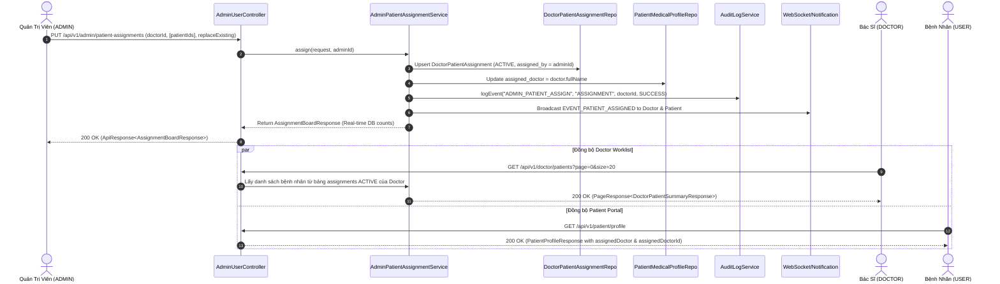
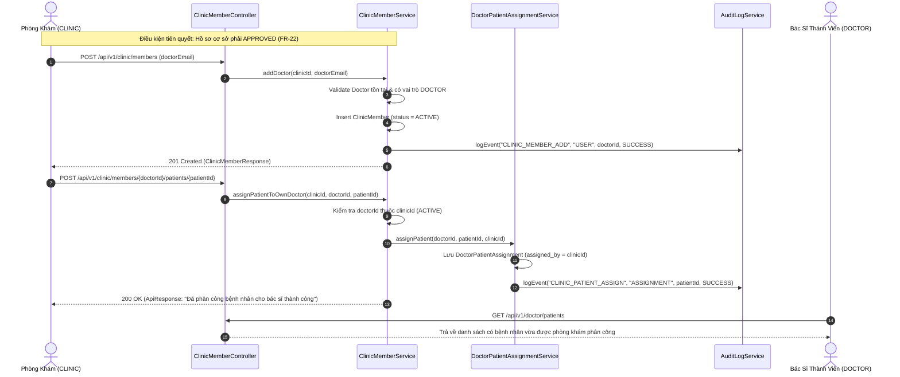
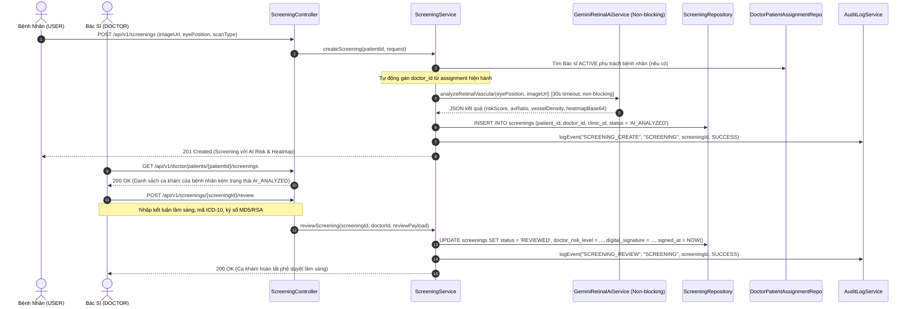

# KIẾN TRÚC KỸ THUẬT TOÀN DIỆN LIÊN KẾT DỮ LIỆU 4 VAI TRÒ (AURA SOLUTION ARCHITECTURE BLUEPRINT)

**Mã tài liệu**: `AURA-ARCH-2026-V027`  
**Phiên bản**: 1.0.0  
**Tác giả**: Kiến Trúc Sư Giải Pháp (Solution Architect)  
**Đối tượng áp dụng**: `backend-developer`, `frontend-developer`, `backend-test-engineer`, `qa-lead`, `data-architect`, `product-owner`  
**Phạm vi**: 4 vai trò hệ thống (`USER/PATIENT`, `DOCTOR`, `CLINIC`, `ADMIN`)  

---

## 1. TỔNG QUAN VÀ NGUYÊN TẮC THIẾT KẾ CỐT LÕI

### 1.1. Hiện trạng và Các điểm ngắt kết nối (Architectural Bottlenecks Identified)
1. **Dữ liệu mồ côi và phân mảnh hồ sơ bệnh nhân**:
   - Tồn tại song song 2 thực thể: `PatientMedicalProfile` (bảng `patient_medical_profiles`, liên kết chuẩn 1-1 với `users`) và `PatientProfile` (bảng `patient_profiles`, sinh ngẫu nhiên 10 hồ sơ có `user_id = NULL` và `assigned_doctor` là chuỗi string tĩnh trong `@PostConstruct`).
   - Endpoint `/api/v1/doctor/patients` khi nhận tham số phân trang (`page`, `size`) lại truy vấn vào bảng `patient_profiles` mồ côi thay vì dữ liệu phân công thực tế từ `doctor_patient_assignments`. Bác sĩ click vào bệnh nhân bị chặn `403 Forbidden` bởi `PatientAccessService`.
2. **Thiếu liên kết 3 chiều trong ca sàng lọc (`screenings`)**:
   - Bảng `screenings` chỉ có `patient_id` và `doctor_id`, hoàn toàn thiếu `clinic_id`. Khi một phòng khám tổ chức sàng lọc hàng loạt hoặc bác sĩ trực thuộc phòng khám thực hiện khám, không có cơ chế truy vết cơ sở y tế chịu trách nhiệm pháp lý.
3. **Mô phỏng dữ liệu (Mock data) trong phân tích phòng khám (`ClinicAnalyticsService`)**:
   - Chỉ số thống kê trả về giá trị cố định (`totalCampaigns: 15`, `totalImages: 1250`, `highRiskPatients: 42`) và file CSV tạo từ chuỗi hardcoded, không liên kết với CSDL thực tế.
4. **Hàng đợi Bulk Screening lưu trữ tạm trong bộ nhớ (In-memory volatility)**:
   - `BatchJobQueue` lưu dữ liệu trong `ConcurrentHashMap`, không bền vững hóa (persistence) xuống PostgreSQL qua các bảng `bulk_screening_batches` và `bulk_screening_items`.
5. **Nhật ký kiểm toán (`audit_logs`) bị cô lập**:
   - Bảng `audit_logs` đã được định nghĩa tại `V009` nhưng không có service nghiệp vụ nào gọi `AuditLogService.logEvent()`, dẫn đến mất dấu vết truy cập (Audit Trail) vi phạm nghiêm trọng chuẩn bảo mật HIPAA/NFR-18.

### 1.2. Nguyên tắc Kiến trúc Toàn vẹn Dữ liệu (Guiding Principles)
- **Single Source of Truth (SSOT)**: `users` là gốc định danh duy nhất. `patient_medical_profiles` là hồ sơ lâm sàng duy nhất của bệnh nhân.
- **Zero Mock Policy**: Triệt tiêu toàn bộ fallback tĩnh, mock data và seed tự do trong mã nguồn Java/React.
- **Tripartite Traceability**: Mọi ca khám sàng lọc phải xác định rõ: Ai là bệnh nhân (`patient_id`), Ai là bác sĩ phụ trách/ký số (`doctor_id`), và Tổ chức y tế nào chủ quản (`clinic_id`).
- **Enforced RBAC & Ownership**: Phân quyền 2 lớp (Role-based kết hợp Resource-ownership) bảo vệ 100% endpoint, loại trừ lỗ hổng IDOR.
- **Audit-by-Design**: Mọi thao tác ghi, cập nhật, thẩm định y khoa và phân công đều tự động phát sinh bản ghi kiểm toán bất biến (Immutable Audit Trail).

---

## 2. MÔ HÌNH DỮ LIỆU QUAN HỆ THỐNG NHẤT (UNIFIED ERD)

```mermaid
erDiagram
    USERS ||--o| PATIENT_MEDICAL_PROFILES : "1-1 clinical profile"
    USERS ||--o| CLINIC_PROFILES : "1-1 verification profile"
    USERS ||--o{ CLINIC_MEMBERS : "doctor membership"
    USERS ||--o{ DOCTOR_PATIENT_ASSIGNMENTS : "assigned doctor/patient"
    USERS ||--o{ SCREENINGS : "patient owns / doctor reviews / clinic organizes"
    USERS ||--o{ BULK_SCREENING_BATCHES : "clinic owns"
    
    CLINIC_PROFILES {
        uuid id PK
        uuid user_id FK "REFERENCES users(id)"
        varchar organization_name
        varchar license_number
        varchar verification_status "PENDING, APPROVED, REJECTED"
    }

    CLINIC_MEMBERS {
        uuid id PK
        uuid clinic_id FK "REFERENCES users(id)"
        uuid doctor_id FK "REFERENCES users(id)"
        varchar status "ACTIVE, REVOKED"
        timestamptz invited_at
    }

    PATIENT_MEDICAL_PROFILES {
        uuid id PK
        uuid user_id FK "UNIQUE REFERENCES users(id)"
        varchar mrn UK
        varchar full_name
        int age
        varchar gender
        int systolic_bp
        int diastolic_bp
        double hba1c
        boolean has_diabetes
        boolean has_hypertension
    }

    DOCTOR_PATIENT_ASSIGNMENTS {
        uuid id PK
        uuid doctor_id FK "REFERENCES users(id)"
        uuid patient_id FK "REFERENCES users(id)"
        varchar status "ACTIVE, INACTIVE"
        uuid assigned_by FK "REFERENCES users(id)"
        timestamptz assigned_at
    }

    SCREENINGS {
        uuid id PK
        uuid patient_id FK "REFERENCES users(id)"
        uuid doctor_id FK "REFERENCES users(id) [Nullable until reviewed]"
        uuid clinic_id FK "REFERENCES users(id) [Nullable for direct patient]"
        uuid batch_item_id FK "REFERENCES bulk_screening_items(id) [Nullable]"
        text image_url
        varchar status "PENDING, AI_ANALYZED, REVIEWED, FAILED"
        varchar risk_level
        varchar ai_risk_level
        varchar doctor_risk_level
        text findings
        text icd10_codes
        text digital_signature
        timestamptz reviewed_at
    }

    BULK_SCREENING_BATCHES {
        uuid id PK
        uuid clinic_id FK "REFERENCES users(id)"
        varchar campaign_name
        int total_images
        int processed_count
        int failed_count
        varchar status "IN_PROGRESS, COMPLETED, CANCELLED"
        timestamptz created_at
    }

    BULK_SCREENING_ITEMS {
        uuid id PK
        uuid batch_id FK "REFERENCES bulk_screening_batches(id)"
        uuid screening_id FK "REFERENCES screenings(id)"
        varchar pseudonym_id
        varchar eye_position
        text image_url
        varchar status
        int risk_score
        varchar risk_level
        timestamptz created_at
    }

    AUDIT_LOGS {
        uuid id PK
        uuid user_id FK "REFERENCES users(id)"
        varchar user_email
        varchar action
        varchar resource_type
        varchar resource_id
        varchar ip_address
        varchar status
        text details
        timestamptz created_at
    }
```



---

## 3. THIẾT KẾ CÁC LUỒNG DỮ LIỆU & HỢP ĐỒNG GIAO TIẾP (API CONTRACTS & DATA FLOWS)

### LUỒNG 1: Admin Phân Công Bác Sĩ - Bệnh Nhân & Đồng Bộ Worklist 3 Phía

#### A. Sơ đồ tuần tự (Sequence Diagram)


#### B. Hợp Đồng API Contract
- **Endpoint**: `PUT /api/v1/admin/patient-assignments`
- **Quyền hạn**: `@PreAuthorize("hasRole('ADMIN')")`
- **Request Payload**:
  ```json
  {
    "doctorId": "22222222-2222-2222-2222-222222222222",
    "patientIds": [
      "11111111-1111-1111-1111-111111111111"
    ],
    "replaceExisting": true
  }
  ```
- **Response Payload (200 OK)**:
  ```json
  {
    "success": true,
    "message": "Phân công bệnh nhân thành công",
    "data": {
      "doctors": [
        {
          "id": "22222222-2222-2222-2222-222222222222",
          "fullName": "BS. CKII Nguyễn Thị Thanh",
          "email": "doctor@aura.com",
          "activePatientCount": 1
        }
      ],
      "patients": [
        {
          "id": "11111111-1111-1111-1111-111111111111",
          "fullName": "Bệnh nhân Nguyễn Trọng Nam",
          "email": "patient@aura.com",
          "mrn": "MRN-2026-0941",
          "assignedDoctorIds": [
            "22222222-2222-2222-2222-222222222222"
          ]
        }
      ]
    }
  }
  ```

- **Quy tắc chuyển dịch trạng thái DB**:
  - Insert hoặc Update trong `doctor_patient_assignments`: `status = 'ACTIVE'`, `assigned_at = NOW()`, `assigned_by = principal.id()`.
  - Nếu `replaceExisting = true`, đổi trạng thái các phân công cũ của `patient_id` thành `INACTIVE`.
  - Cập nhật trường `assigned_doctor` trong `patient_medical_profiles` bằng tên hiển thị của bác sĩ.

---

### LUỒNG 2: Phòng Khám Quản Lý Bác Sĩ & Phân Phối Ca Khám Lâm Sàng

#### A. Sơ đồ tuần tự (Sequence Diagram)


#### B. Hợp Đồng API Contract
1. **Thêm bác sĩ thành viên**:
   - `POST /api/v1/clinic/members`
   - Request: `{"doctorEmail": "doctor@aura.com"}`
   - Response (201 Created):
     ```json
     {
       "success": true,
       "message": "Đã thêm bác sĩ vào phòng khám",
       "data": {
         "id": "77777777-7777-7777-7777-777777777771",
         "doctorId": "22222222-2222-2222-2222-222222222222",
         "doctorName": "BS. CKII Nguyễn Thị Thanh",
         "doctorEmail": "doctor@aura.com",
         "status": "ACTIVE",
         "invitedAt": "2026-09-14T08:00:00Z"
       }
     }
     ```
2. **Phòng khám phân công bệnh nhân**:
   - `POST /api/v1/clinic/members/{doctorId}/patients/{patientId}`
   - Path Params: `doctorId` (UUID tài khoản Bác sĩ), `patientId` (UUID tài khoản Bệnh nhân).
   - Response (200 OK): `{"success": true, "message": "Đã phân công bệnh nhân cho bác sĩ thành công", "data": null}`.

---

### LUỒNG 3: Ca Khám Sàng Lọc Liên Kết 3 Chiều & Quy Trình Thẩm Định CDS

#### A. Sơ đồ tuần tự (Sequence Diagram)


#### B. Hợp Đồng API Contract
- **Tạo ca khám (Patient / Clinic)**:
  - `POST /api/v1/screenings`
  - Headers: `Authorization: Bearer <JWT>`
  - Request:
    ```json
    {
      "imageUrl": "data:image/png;base64,iVBORw0KGgo...",
      "eyePosition": "OD",
      "scanType": "Fundus",
      "fileName": "fundus_scan_right.png",
      "fileSize": 2048576,
      "mimeType": "image/png",
      "clinicId": "33333333-3333-3333-3333-333333333333"
    }
    ```
  - Response (201 Created):
    ```json
    {
      "success": true,
      "message": "Phân tích võng mạc thành công",
      "data": {
        "id": "a1000000-0000-0000-0000-000000000099",
        "patientId": "11111111-1111-1111-1111-111111111111",
        "doctorId": "22222222-2222-2222-2222-222222222222",
        "clinicId": "33333333-3333-3333-3333-333333333333",
        "status": "AI_ANALYZED",
        "riskLevel": "HIGH",
        "aiRiskLevel": "HIGH",
        "doctorRiskLevel": null,
        "confidence": 0.89,
        "riskScore": 82,
        "avRatio": 0.52,
        "vesselDensity": "14.8%",
        "heatmapBase64": "data:image/png;base64,iVBORw0KGgo...",
        "digitalSignature": null,
        "reviewedAt": null
      }
    }
    ```

- **Bác sĩ thẩm định & ký số (Doctor CDS Review)**:
  - `POST /api/v1/screenings/{screeningId}/review`
  - `@PreAuthorize("hasRole('DOCTOR') && @patientAccessService.canReviewScreening(principal, #screeningId)")`
  - Request:
    ```json
    {
      "reviewDecision": "CONFIRMED",
      "doctorRiskLevel": "HIGH",
      "doctorCardiovascularRiskLevel": "HIGH",
      "doctorDiabeticRetinopathyRiskLevel": "MODERATE",
      "icd10Codes": "H35.0, I10",
      "doctorNotes": "Xác nhận co hẹp tiểu động mạch vùng thái dương, dấu Gunn (+). Đề nghị kiểm soát huyết áp nghiêm ngặt.",
      "digitalSignature": "SHA256withRSA:4a8b...7f2e"
    }
    ```
  - Response (200 OK):
    ```json
    {
      "success": true,
      "message": "Thẩm định ca khám và ký số thành công",
      "data": {
        "id": "a1000000-0000-0000-0000-000000000099",
        "status": "REVIEWED",
        "reviewDecision": "CONFIRMED",
        "doctorRiskLevel": "HIGH",
        "signedAt": "2026-09-14T09:15:00Z"
      }
    }
    ```

---

### LUỒNG 4: Giám Sát & Ghi Nhận Kiểm Toán Toàn Diện (Audit Logging for 4 Roles)

#### A. Ma Trận Hành Vi Kiểm Toán (Audit Action Matrix)

| Vai trò (Role) | Mã Hành Vi (`action`) | Loại Tài Nguyên (`resource_type`) | Mục Tiêu Ghi Nhận & Tuân Thủ |
| :--- | :--- | :--- | :--- |
| **USER** | `SCREENING_CREATE` | `SCREENING` | Tạo phiên khám sàng lọc mới |
| **USER** | `PROFILE_UPDATE` | `PATIENT_PROFILE` | Thay đổi bệnh sử, chỉ số huyết áp, HbA1c |
| **USER** | `LAB_DOC_UPLOAD` | `LAB_DOCUMENT` | Đính kèm tài liệu xét nghiệm y khoa |
| **USER** | `LAB_DOC_DELETE` | `LAB_DOCUMENT` | Xóa tài liệu xét nghiệm |
| **DOCTOR** | `PATIENT_RECORD_VIEW` | `PATIENT_PROFILE` | Truy cập hồ sơ bệnh án (HIPAA Access Log) |
| **DOCTOR** | `SCREENING_REVIEW` | `SCREENING` | Thẩm định kết quả AI, ký số y tế |
| **DOCTOR** | `AI_FEEDBACK_SUBMIT`| `DOCTOR_FEEDBACK` | Đóng góp phản hồi hiệu chuẩn mô hình |
| **CLINIC** | `CLINIC_PROFILE_SUBMIT` | `CLINIC_PROFILE` | Nộp hồ sơ xác minh pháp nhân (FR-22) |
| **CLINIC** | `CLINIC_MEMBER_ADD` | `CLINIC_MEMBER` | Thêm bác sĩ vào danh sách hành nghề |
| **CLINIC** | `CLINIC_MEMBER_REMOVE` | `CLINIC_MEMBER` | Gỡ quyền bác sĩ khỏi cơ sở |
| **CLINIC** | `CLINIC_PATIENT_ASSIGN` | `ASSIGNMENT` | Phân công ca khám cho bác sĩ cơ sở |
| **CLINIC** | `BULK_BATCH_CREATE` | `BULK_BATCH` | Khởi chạy đợt sàng lọc cộng đồng |
| **ADMIN** | `USER_STATUS_TOGGLE`| `USER` | Khóa/Mở tài khoản người dùng |
| **ADMIN** | `USER_ROLE_CHANGE` | `USER_ROLE` | Phân bổ lại vai trò hệ thống (RBAC) |
| **ADMIN** | `CLINIC_VERIFY` | `CLINIC_PROFILE` | Phê duyệt hoặc từ chối pháp nhân |
| **ADMIN** | `ADMIN_PATIENT_ASSIGN`| `ASSIGNMENT` | Điều phối phân công bác sĩ toàn viện |
| **ADMIN** | `AI_CONFIG_UPDATE` | `AI_CONFIG` | Thay đổi ngưỡng cảnh báo mô hình |
| **ADMIN** | `AUDIT_LOG_EXPORT` | `AUDIT_LOG` | Xuất file nhật ký điều tra an ninh |

#### B. Cơ chế Kiến trúc Thực thi (Architecture Implementation Mechanism)
- Triển khai `AuditLoggingAspect` (Spring AOP) chặn các method có chú thích `@AuditAction(action = ..., resourceType = ...)` hoặc gọi trực tiếp từ Service Layer.
- Tự động bóc tách:
  - `userId`, `userEmail` từ `SecurityContextHolder` (`AuraUserPrincipal`).
  - `ipAddress` qua `HttpServletRequest.getHeader("X-Forwarded-For")` hoặc `getRemoteAddr()`.
  - `userAgent` qua `HttpServletRequest.getHeader("User-Agent")`.
  - `status`: `SUCCESS` hoặc `FAILED`.
  - `details`: JSON tóm tắt các trường thay đổi (tuyệt đối không ghi thông tin nhạy cảm/mật khẩu/ảnh Base64 thô).

---

### LUỒNG 5: Phân Tích Dữ Liệu Thực Phòng Khám (`/clinic/analytics`) Thay Thế Mock Data

#### A. Cơ chế Tính Toán Thực Tế trên CSDL (Real-time DB Aggregation Engine)
Thay vì trả về các hằng số giả lập (`totalCampaigns = 15`, `totalImages = 1250`, `highRiskPatients = 42`), `ClinicAnalyticsService` thực thi các câu truy vấn tổng hợp trực tiếp trên PostgreSQL:

1. **Tổng số chiến dịch (`totalCampaigns`)**:
   ```sql
   SELECT COUNT(id) FROM bulk_screening_batches WHERE clinic_id = :clinicId;
   ```
2. **Tổng số ảnh đã quét (`totalImages`)**:
   ```sql
   SELECT COUNT(id) FROM screenings WHERE clinic_id = :clinicId;
   ```
3. **Số bệnh nhân nguy cơ cao/nguy kịch (`highRiskPatients`)**:
   ```sql
   SELECT COUNT(DISTINCT patient_id) 
   FROM screenings 
   WHERE clinic_id = :clinicId 
     AND (risk_level IN ('HIGH', 'CRITICAL') OR doctor_risk_level IN ('HIGH', 'CRITICAL'));
   ```
4. **Phân bố nguy cơ (Risk Distribution Breakdown)**:
   ```sql
   SELECT COALESCE(doctor_risk_level, risk_level) AS risk, COUNT(id) AS count
   FROM screenings
   WHERE clinic_id = :clinicId
   GROUP BY COALESCE(doctor_risk_level, risk_level);
   ```

#### B. Hợp Đồng API Contract
- **Endpoint**: `GET /api/v1/clinic/analytics/campaigns`
- **Quyền hạn**: `@PreAuthorize("hasRole('CLINIC')")`
- **Response Payload (200 OK)**:
  ```json
  {
    "success": true,
    "message": "Lấy báo cáo phân tích chiến dịch thành công",
    "data": {
      "clinicId": "33333333-3333-3333-3333-333333333333",
      "totalCampaigns": 3,
      "totalImages": 142,
      "processedImages": 140,
      "failedImages": 2,
      "highRiskPatients": 18,
      "moderateRiskPatients": 45,
      "lowRiskPatients": 77,
      "activeDoctorsCount": 4,
      "campaignsSummary": [
        {
          "batchId": "b1000000-0000-0000-0000-000000000001",
          "campaignName": "Sàng lọc Đáy mắt Phường Bến Nghé Q1",
          "totalImages": 100,
          "processedCount": 100,
          "highRiskCount": 12,
          "createdAt": "2026-09-01T08:30:00Z",
          "status": "COMPLETED"
        }
      ]
    }
  }
  ```

- **Xuất CSV Báo Cáo Thực Tế**:
  - `GET /api/v1/clinic/analytics/export`
  - Header: `Content-Disposition: attachment; filename="aura_clinic_campaigns_real.csv"`
  - Content: Tạo động từ bảng `bulk_screening_batches` và `screenings` của chính `clinicId` đang đăng nhập, không có dữ liệu tĩnh.

---

## 4. BẢN ĐẶC TẢ DI TRÚ CƠ SỞ DỮ LIỆU FLYWAY V027

Tệp tin mới: `backend/src/main/resources/db/migration/V027__unify_4roles_data_linkage_and_bulk_persistence.sql`

```sql
-- ====================================================================
-- V027: Chuẩn hóa liên kết 4 vai trò, triệt tiêu dữ liệu mồ côi và
-- bền vững hóa hàng đợi sàng lọc hàng loạt (AURA SSOT & Zero-Mock)
-- ====================================================================

-- 1. Bổ sung liên kết phòng khám (clinic_id) và batch_item vào bảng screenings
ALTER TABLE screenings ADD COLUMN IF NOT EXISTS clinic_id UUID REFERENCES users(id) ON DELETE SET NULL;
ALTER TABLE screenings ADD COLUMN IF NOT EXISTS batch_id UUID;
CREATE INDEX IF NOT EXISTS idx_screenings_clinic_id ON screenings(clinic_id);
CREATE INDEX IF NOT EXISTS idx_screenings_clinic_risk ON screenings(clinic_id, risk_level);

-- 2. Tạo bảng lưu trữ đợt sàng lọc hàng loạt (Bulk Screening Batches Persistence)
CREATE TABLE IF NOT EXISTS bulk_screening_batches (
    id UUID PRIMARY KEY DEFAULT gen_random_uuid(),
    clinic_id UUID NOT NULL REFERENCES users(id) ON DELETE CASCADE,
    campaign_name VARCHAR(255) NOT NULL,
    total_images INT NOT NULL DEFAULT 0,
    processed_count INT NOT NULL DEFAULT 0,
    failed_count INT NOT NULL DEFAULT 0,
    status VARCHAR(32) NOT NULL DEFAULT 'IN_PROGRESS',
    created_at TIMESTAMPTZ NOT NULL DEFAULT CURRENT_TIMESTAMP,
    updated_at TIMESTAMPTZ NOT NULL DEFAULT CURRENT_TIMESTAMP,
    CONSTRAINT chk_bulk_batch_status CHECK (status IN ('IN_PROGRESS', 'COMPLETED', 'CANCELLED', 'FAILED'))
);
CREATE INDEX IF NOT EXISTS idx_bulk_batches_clinic_id ON bulk_screening_batches(clinic_id);
CREATE INDEX IF NOT EXISTS idx_bulk_batches_status ON bulk_screening_batches(status);

-- 3. Tạo bảng chi tiết từng ảnh trong đợt sàng lọc hàng loạt (Bulk Screening Items)
CREATE TABLE IF NOT EXISTS bulk_screening_items (
    id UUID PRIMARY KEY DEFAULT gen_random_uuid(),
    batch_id UUID NOT NULL REFERENCES bulk_screening_batches(id) ON DELETE CASCADE,
    screening_id UUID REFERENCES screenings(id) ON DELETE SET NULL,
    pseudonym_id VARCHAR(64) NOT NULL,
    raw_patient_name VARCHAR(150),
    raw_mrn VARCHAR(64),
    patient_age INT,
    patient_gender VARCHAR(16),
    eye_position VARCHAR(16) NOT NULL DEFAULT 'OD',
    image_url TEXT NOT NULL,
    status VARCHAR(32) NOT NULL DEFAULT 'PENDING',
    risk_score INT,
    risk_level VARCHAR(32),
    confidence DOUBLE PRECISION,
    findings TEXT,
    processing_duration_ms BIGINT DEFAULT 0,
    error_message TEXT,
    created_at TIMESTAMPTZ NOT NULL DEFAULT CURRENT_TIMESTAMP,
    updated_at TIMESTAMPTZ NOT NULL DEFAULT CURRENT_TIMESTAMP
);
CREATE INDEX IF NOT EXISTS idx_bulk_items_batch_id ON bulk_screening_items(batch_id);
CREATE INDEX IF NOT EXISTS idx_bulk_items_status ON bulk_screening_items(status);

-- 4. Đồng bộ và làm sạch dữ liệu hồ sơ lâm sàng bệnh nhân (Eliminate Orphan Profiles)
-- Đảm bảo tài khoản bệnh nhân mặc định có hồ sơ chuẩn xác
INSERT INTO patient_medical_profiles (
    id, user_id, mrn, date_of_birth, age, gender, phone_number, address, blood_type,
    systolic_bp, diastolic_bp, hba1c, has_diabetes, diabetes_type, diabetes_duration_years,
    has_hypertension, history_of_smoking, history_of_heart_disease, history_of_stroke,
    assigned_doctor, created_at, updated_at
) VALUES (
    '55555555-5555-5555-5555-555555555501',
    '11111111-1111-1111-1111-111111111111',
    'MRN-2026-0941',
    '1968-05-14',
    58,
    'Male',
    '0912 345 678',
    'Quận 1, TP. Hồ Chí Minh',
    'O+',
    154,
    96,
    8.2,
    TRUE,
    'Type 2',
    6,
    TRUE,
    TRUE,
    FALSE,
    FALSE,
    'BS. CKII Nguyễn Thị Thanh',
    NOW(),
    NOW()
) ON CONFLICT (user_id) DO UPDATE SET
    mrn = 'MRN-2026-0941',
    assigned_doctor = 'BS. CKII Nguyễn Thị Thanh',
    systolic_bp = 154,
    diastolic_bp = 96,
    hba1c = 8.2,
    has_diabetes = TRUE,
    has_hypertension = TRUE;

-- 5. Seed hồ sơ pháp nhân phòng khám mặc định ở trạng thái APPROVED và gán bác sĩ thành viên
INSERT INTO clinic_profiles (
    id, user_id, organization_name, license_number, verification_status, submitted_at, reviewed_at, created_at, updated_at
) VALUES (
    '66666666-6666-6666-6666-666666666601',
    '33333333-3333-3333-3333-333333333333',
    'Phòng khám Đa khoa AURA',
    '07891/HCM-GPHĐ',
    'APPROVED',
    NOW(),
    NOW(),
    NOW(),
    NOW()
) ON CONFLICT (user_id) DO UPDATE SET verification_status = 'APPROVED';

-- Gán Bác sĩ mặc định vào Phòng khám Đa khoa AURA
INSERT INTO clinic_members (
    id, clinic_id, doctor_id, status, invited_at, created_at, updated_at
) VALUES (
    '77777777-7777-7777-7777-777777777701',
    '33333333-3333-3333-3333-333333333333',
    '22222222-2222-2222-2222-222222222222',
    'ACTIVE',
    NOW(),
    NOW(),
    NOW()
) ON CONFLICT (clinic_id, doctor_id) DO UPDATE SET status = 'ACTIVE';

-- 6. Cập nhật clinic_id cho 9 ca khám hiện có tại V022 để liên kết hoàn chỉnh 3 chiều
UPDATE screenings 
SET clinic_id = '33333333-3333-3333-3333-333333333333'
WHERE patient_id = '11111111-1111-1111-1111-111111111111' 
  AND clinic_id IS NULL;

-- 7. Dọn dẹp các bản ghi mồ côi trong patient_profiles (user_id IS NULL)
DELETE FROM patient_profiles WHERE user_id IS NULL;
```

---

## 5. KẾ HOẠCH HÀNH ĐỘNG CHI TIẾT (ACTION ITEMS)

### 5.1. Phân Công Cho `backend-developer`
- [ ] **Flyway V027**: Soạn thảo và kiểm chứng file `V027__unify_4roles_data_linkage_and_bulk_persistence.sql` như đặc tả trên.
- [ ] **Entity JPA Updates**:
  - `Screening.java`: Thêm trường `@Column(name = "clinic_id") private UUID clinicId;`, quan hệ `@Column(name = "batch_id") private UUID batchId;`. Bổ sung Getter/Setter.
  - Tạo entity `BulkScreeningBatch.java` (mapping bảng `bulk_screening_batches`) và `BulkScreeningItem.java` (mapping bảng `bulk_screening_items`).
  - Tạo Repository tương ứng: `BulkScreeningBatchRepository`, `BulkScreeningItemRepository`.
- [ ] **Tái cấu trúc Services (Service Refactoring)**:
  - `PatientProfileService`: Xóa bỏ phương thức `@PostConstruct seedInitialPatientsIfEmpty()` đang chèn bệnh nhân ảo có `user_id = null`. Hợp nhất phương thức tìm kiếm `searchPatients` để ưu tiên truy vấn theo danh sách bệnh nhân được phân công thực tế từ `doctor_patient_assignments`.
  - `DoctorPatientController`: Sửa method `getPatients` để khi người dùng có vai trò `DOCTOR`, luôn lọc bệnh nhân theo `assignmentRepository.findByDoctorIdAndStatus(doctorId, ACTIVE)` trước khi áp dụng tìm kiếm / phân trang.
  - `ScreeningService`: Trong `createScreening`, tự động truy vấn tìm `assignedDoctor` từ `DoctorPatientAssignmentRepository` nếu `doctorId` chưa được chỉ định; gán `clinicId` nếu request truyền lên hoặc lấy từ thông tin tổ chức của bác sĩ/bệnh nhân.
  - `ClinicAnalyticsService`: Xóa bỏ toàn bộ hardcoded map (`15`, `1250`, `42`) và chuỗi CSV mẫu. Viết câu truy vấn JPA/JPQL tổng hợp trực tiếp từ `ScreeningRepository` và `BulkScreeningBatchRepository`.
  - `ClinicMemberService`: Đảm bảo `addDoctor` và `assignPatientToOwnDoctor` ghi nhận đầy đủ bản ghi audit log và kiểm tra đúng `ClinicMemberStatus.ACTIVE`.
- [ ] **Tích hợp Nhật ký kiểm toán (Audit Logging)**:
  - Bổ sung lời gọi `auditLogService.logEvent(...)` vào tất cả các điểm mấu chốt: tạo ca khám, bác sĩ thẩm định ký số, phân công bệnh nhân, thêm/gỡ thành viên phòng khám, admin phê duyệt cơ sở, admin phân công.

### 5.2. Phân Công Cho `frontend-developer`
- [ ] **Xóa bỏ Fallback & Mock Data**:
  - `frontend/src/pages/ClinicPortalPage.tsx`: Sửa lỗi truyền sai ID bác sĩ tại `handleAssignPatient`. Thay vì dùng `res.data[0].id` (là `ClinicMember.id`), bắt buộc dùng `m.doctorId`. Thay thế ô nhập text `patientIdToAssign` bằng danh sách chọn bệnh nhân (Dropdown/Combobox) thực tế từ API.
  - `frontend/src/components/ClinicCampaignAnalytics.tsx`: Liên kết trực tiếp với dữ liệu API `clinicAnalyticsApi.getCampaignAnalytics()`, hiển thị thông báo rỗng ("Chưa có dữ liệu chiến dịch") nếu cơ sở chưa thực hiện ca khám nào thay vì hiển thị dữ liệu giả.
  - `frontend/src/pages/DoctorPatientListPage.tsx`: Đảm bảo component nhận đúng danh sách bệnh nhân từ `res.data.items` gắn liền với `User.id` thật; khi click vào bệnh nhân thì ID truyền vào CDS Viewer phải là UUID của tài khoản bệnh nhân để không bị lỗi 403.
  - `frontend/src/pages/PatientPortalPage.tsx`: Đảm bảo khi `assignedDoctorId` có giá trị, hiển thị tên bác sĩ phụ trách từ `profileRes.data.assignedDoctor`, kích hoạt nút chat tư vấn trực tuyến và liên kết cuộc hội thoại.
  - `frontend/src/pages/AdminAuditLogsPage.tsx` / `AdminAuditWorkspace.tsx`: Kiểm tra hiển thị đầy đủ các hành vi của cả 4 vai trò trên bảng lịch sử kiểm toán, có bộ lọc theo `role`, `action`, `dateRange`.

### 5.3. Phân Công Cho `backend-test-engineer` & `qa-lead`
Bộ test tích hợp chéo vai trò (Cross-Role Integration Test Suite) bắt buộc phải PASS 100%:

1. **Test Suite 1: Admin Assignment to Doctor Worklist & Patient Portal (Luồng 1)**
   - *Bước 1*: Đăng nhập `admin@aura.com`, gọi `PUT /api/v1/admin/patient-assignments` gán bệnh nhân `patient@aura.com` cho bác sĩ `doctor@aura.com`.
   - *Bước 2*: Đăng nhập `doctor@aura.com`, gọi `GET /api/v1/doctor/patients`. Kỳ vọng: Bệnh nhân `patient@aura.com` xuất hiện trong worklist, HTTP 200.
   - *Bước 3*: Đăng nhập `doctor@aura.com`, gọi `GET /api/v1/doctor/patients/{patientId}`. Kỳ vọng: Trả về chi tiết hồ sơ bệnh nhân, HTTP 200 (không bị 403).
   - *Bước 4*: Đăng nhập `patient@aura.com`, gọi `GET /api/v1/patient/profile`. Kỳ vọng: `assignedDoctorId` trùng khớp với ID của `doctor@aura.com`.

2. **Test Suite 2: Clinic Member Management & Patient Delegation (Luồng 2)**
   - *Bước 1*: Đăng nhập `clinic@aura.com` (đã APPROVED), gọi `POST /api/v1/clinic/members` thêm bác sĩ `doctor@aura.com`.
   - *Bước 2*: Gọi `POST /api/v1/clinic/members/{doctorId}/patients/{patientId}` phân công bệnh nhân cho bác sĩ thành viên.
   - *Bước 3*: Đăng nhập `doctor@aura.com`, kiểm tra worklist thấy ca khám mới được phân công.
   - *Bước 4*: Gọi API với một phòng khám chưa APPROVED (PENDING). Kỳ vọng: Bị từ chối với thông báo yêu cầu xác minh pháp nhân, HTTP 400/403.

3. **Test Suite 3: Tripartite Screening Linkage & CDS Review (Luồng 3)**
   - *Bước 1*: Bệnh nhân `patient@aura.com` tạo ca khám mới tại `POST /api/v1/screenings`.
   - *Bước 2*: Xác minh trong CSDL: `screenings.patient_id` = Patient ID, `screenings.doctor_id` = Doctor ID (được tự động giải quyết từ assignment), `screenings.clinic_id` = Clinic ID (nếu qua kênh phòng khám).
   - *Bước 3*: Bác sĩ `doctor@aura.com` gọi `POST /api/v1/screenings/{id}/review` có ký số và mã ICD-10.
   - *Bước 4*: Xác minh trạng thái chuyển thành `REVIEWED`, `doctor_risk_level` được cập nhật, chữ ký số được lưu toàn vẹn.

4. **Test Suite 4: Audit Trail Verification Across 4 Roles (Luồng 4)**
   - *Bước 1*: Thực hiện lần lượt 4 hành vi từ 4 tài khoản (`patient@aura.com`, `doctor@aura.com`, `clinic@aura.com`, `admin@aura.com`).
   - *Bước 2*: Đăng nhập `admin@aura.com`, gọi `GET /api/v1/admin/audit-logs`.
   - *Bước 3*: Xác minh cả 4 sự kiện đều xuất hiện trong bảng `audit_logs` với đúng `user_email`, `action`, `resource_type`, `ip_address` và `status = 'SUCCESS'`.

5. **Test Suite 5: Clinic Analytics Real Database Calculation (Luồng 5)**
   - *Bước 1*: Khởi tạo một đợt sàng lọc hàng loạt cho `clinic@aura.com` với 5 ảnh (trong đó 2 ảnh có điểm nguy cơ $\ge 65$).
   - *Bước 2*: Gọi `GET /api/v1/clinic/analytics/campaigns`.
   - *Bước 3*: Xác minh số liệu trả về: `totalCampaigns` tăng đúng 1, `totalImages` tăng đúng 5, `highRiskPatients` tính toán chính xác dựa trên CSDL thật, không còn bất kỳ số liệu 15, 1250, 42 nào.

---

## 6. MA TRẬN ĐÁNH GIÁ RỦI RO & PHƯƠNG ÁN GIẢI TỎA (RISK & MITIGATION)

| Rủi ro Kiến trúc | Mức độ | Hậu quả nếu xảy ra | Giải pháp Giảm thiểu (Mitigation Strategy) |
| :--- | :--- | :--- | :--- |
| **Xung đột phân công Bác sĩ** (Nhiều phòng khám cùng gán 1 bệnh nhân) | Trung bình | Gây nhầm lẫn worklist bác sĩ | Cột `doctor_patient_assignments.assigned_by` ghi rõ nguồn gốc phân công. Cho phép 1 bệnh nhân có thể có bác sĩ gia đình và bác sĩ chuyên khoa chiến dịch. |
| **Khóa chết bảng `screenings`** khi phân tích hàng loạt | Cao | Gây nghẽn Connection Pool CSDL | Tách bạch cuộc gọi AI Engine (Non-blocking I/O) ra ngoài `@Transactional`. Chỉ mở transaction ngắn gọn khi ghi nhận kết quả hoặc cập nhật trạng thái. |
| **Lỗ hổng IDOR** xem chéo hồ sơ bệnh án giữa các bác sĩ | Nghiêm trọng | Vi phạm an toàn y khoa & quyền riêng tư PHI | `PatientAccessService` bắt buộc kiểm tra điều kiện sở hữu: `assignmentRepository.existsByDoctorIdAndPatientIdAndStatus(doctorId, patientId, ACTIVE)`. Không phân công thì cấm truy cập (403). |
| **Mất dữ liệu hàng đợi** khi server restart | Cao | Hỏng tiến trình sàng lọc hàng loạt của phòng khám | Bền vững hóa toàn bộ đợt khám vào bảng `bulk_screening_batches` và `bulk_screening_items` ngay khi tiếp nhận request. |
