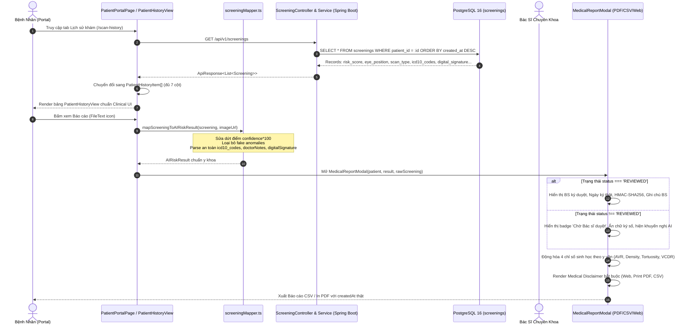

# TÀI LIỆU THIẾT KẾ GIẢI PHÁP KIẾN TRÚC (SOLUTION DESIGN DOCUMENT - SDD)
## TỐI ƯU HÓA LUỒNG SÀNG LỌC LÂM SÀNG, QUẢN LÝ LỊCH SỬ & BÁO CÁO Y KHOA AURA
*Mã tài liệu: `AURA-SDD-2026-005`*  
*Phiên bản: `1.0.0`*  
*Tác giả: Kiến Trúc Sư Giải Pháp (Solution Architect)*  
*Căn cứ nghiệp vụ: Báo cáo Product Owner & Healthcare Domain Analyst*  
*Đối tượng áp dụng: `frontend-developer`, `backend-developer`, `frontend-lead`, `backend-lead`*  

---

## 1. BỐI CẢNH & PHÂN TÍCH RỦI RO KIẾN TRÚC

### 1.1. Hiện trạng Codebase & Các Khiếm Khuyết Nghiêm Trọng
1. **Vi phạm Quy tắc An toàn Y khoa (Medical Safety Rule 2.1 - Confidence vs Risk Score)**:
   - Tại `screeningMapper.ts`: `overallScore` được tính bằng `screening.confidence * 100`.
   - *Hệ quả lâm sàng*: Nhầm lẫn tai hại giữa độ tin cậy mô hình toán học (Model Confidence) và điểm nguy cơ bệnh học (Pathological Risk Score). Một ca đáy mắt hoàn toàn bình thường được AI nhận diện với độ tự tin 98% lại bị gán điểm nguy cơ 98/100 (Báo động Đỏ giả - False Positive trầm trọng).
2. **Vi phạm Quy tắc Cấm Dữ liệu Giả (Medical Safety Rule 3.1 - No Mock in Production)**:
   - Tại `generateAnomaliesFromMetrics`: Tự ý gán cứng các tọa độ giả lập (`ANO-AV-1`, `ANO-MA-2`, `ANO-HEM-3`) với bounding box cố định (`{ x: 38, y: 44, width: 28, height: 28 }`).
   - *Hệ quả*: Đánh lừa bác sĩ chuyên khoa về vị trí vi phình mạch và xuất huyết khi ảnh gốc không hề có tổn thương tại tọa độ đó.
3. **Phá vỡ Ranh giới Dữ liệu Thực (Data Mismatch & Missing Real Fields)**:
   - Các trường thực tế trong CSDL PostgreSQL (`risk_score`, `eye_position`, `scan_type`, `icd10_codes`, `doctor_notes`, `digital_signature`, `signed_at`, `created_at`) chưa được ánh xạ đầy đủ lên tầng biểu diễn Frontend.
   - Bảng lịch sử trong `PatientPortalPage.tsx` đang viết HTML `<table>` inline thô sơ, thiếu các cột chuẩn lâm sàng, chưa tái sử dụng component `PatientHistoryView`.
4. **Thiếu Tuyên bố Miễn trừ Trách nhiệm Y tế & Đánh giá Chỉ số Bất biến (Static Hardcoding)**:
   - `MedicalReportModal.tsx` không có Tuyên bố Miễn trừ Y tế (Medical Disclaimer) theo quy chuẩn CE-MDR / FDA SaMD.
   - Cột Đánh giá lâm sàng cho 4 chỉ số sinh học (A/V Ratio, Vessel Density, Tortuosity, VCDR) bị fix cứng chuỗi text, không phản ánh theo đúng giá trị số thực tế của người bệnh.
   - Hiển thị chữ ký bác sĩ và tên bác sĩ ngay cả khi ca khám chưa hề được bác sĩ duyệt (`status !== 'REVIEWED'`).
   - Lệnh xuất CSV và In PDF sử dụng `new Date()` hiện tại thay vì thời điểm thực tế ca khám được tạo (`createdAt`).

---

## 2. QUYẾT ĐỊNH KIẾN TRÚC (ARCHITECTURE DECISION RECORDS - ADR-005)

### ADR-005.1: Chuẩn hóa Điểm Rủi ro Lâm sàng
- **Quyết định**: `overallVascularRiskScore` và `riskScore` bắt buộc phải trích xuất từ cột `risk_score` trong CSDL PostgreSQL (hoặc `overallVascularRiskScore` do mô hình AI tính toán).
- **Công thức tính toán dự phòng (Fallback Formula)**:
  $$\text{overallScore} = \text{screening.riskScore} \;\lor\; \text{Math.round}\left(\frac{\text{cvdScore} + \text{drScore}}{2}\right)$$
- **Nghiêm cấm**: Tuyệt đối không sử dụng `confidence * 100`. Trường `confidence` chỉ được hiển thị ở thuộc tính độ tin cậy mô hình đi kèm.

### ADR-005.2: Triệt tiêu Hoàn toàn Tọa độ Tổn thương Giả lập
- **Quyết định**: Xóa bỏ vĩnh viễn hàm `generateAnomaliesFromMetrics`.
- **Nguyên tắc**: `detectedAnomalies` chỉ được lấy từ dữ liệu thực do AI/Database trả về (`screening.detectedAnomalies` hoặc `screening.anomalies`). Nếu không có dữ liệu, trả về mảng rỗng `[]`. Giao diện XAI tập trung hiển thị Heatmap Grad-CAM thật và 4 chỉ số sinh học định lượng.

### ADR-005.3: Cổng Kiểm Soát Thẩm Định Lâm Sàng & Chữ Ký Số (Doctor Review Gate)
- **Quyết định**: Áp dụng cổng điều kiện trạng thái nghiêm ngặt:
  $$\text{isReviewed} \iff (\text{status} = \text{'REVIEWED'} \lor \text{digitalSignature} \neq \text{null})$$
- Nếu `isReviewed === true`: Hiển thị định danh Bác sĩ, Dấu thời gian ký duyệt thật (`signedAt`), Chuỗi băm `HMAC-SHA256` và Nhận xét lâm sàng thực tế (`doctorNotes`).
- Nếu `isReviewed === false`: Hiển thị cảnh báo "Đang Chờ Bác Sĩ Thẩm Định", khóa hiển thị chữ ký số, chỉ đưa ra khuyến nghị sơ bộ từ AI.

---

## 3. SƠ ĐỒ LUỒNG DỮ LIỆU TOÀN DIỆN (END-TO-END DATA FLOW)



---

## 4. BẢN ĐẶC TẢ THIẾT KẾ KỸ THUẬT CHI TIẾT DÀNH CHO DEVELOPER

### 4.1. Module: `frontend/src/services/screeningMapper.ts`

#### A. Mục tiêu
- Ánh xạ toàn vẹn 100% các trường CSDL PostgreSQL vào đối tượng `AIRiskResult`.
- Loại bỏ triệt để hàm `generateAnomaliesFromMetrics`.
- Tính toán `overallVascularRiskScore` đúng bản chất y học.
- Phân tích an toàn trường `icd10Codes` (chuỗi phân tách newline/comma hoặc JSON string).

#### B. Định nghĩa Logic Ánh Xạ Chuẩn
```typescript
import { AIRiskResult, RiskLevel, VesselAnomalyRegion } from '../types/cds';

/**
 * Chuyển đổi mức rủi ro do backend trả về sang RiskLevel UI
 */
export const toFrontendRiskLevel = (level?: string | null): RiskLevel => {
  switch ((level || '').toUpperCase()) {
    case 'CRITICAL':
      return 'Severe';
    case 'HIGH':
      return 'High';
    case 'MODERATE':
      return 'Moderate';
    default:
      return 'Low';
  }
};

/**
 * Phân tích danh mục mã ICD-10 an toàn từ Backend CSDL (TEXT column)
 */
export const parseIcd10Codes = (rawCodes?: any): string[] => {
  if (!rawCodes) return [];
  if (Array.isArray(rawCodes)) return rawCodes.map(String).filter(Boolean);
  if (typeof rawCodes === 'string') {
    const trimmed = rawCodes.trim();
    if (!trimmed) return [];
    try {
      const parsed = JSON.parse(trimmed);
      if (Array.isArray(parsed)) return parsed.map(String).filter(Boolean);
    } catch {
      // Chuỗi phân cách bởi ký tự xuống dòng, dấu phẩy hoặc chấm phẩy
      return trimmed
        .split(/[\r\n,;]+/)
        .map((code) => code.trim())
        .filter(Boolean);
    }
  }
  return [];
};

/**
 * Chuyển đổi bản ghi Screening từ backend sang AIRiskResult
 */
export const mapScreeningToAIRiskResult = (screening: any, fallbackImageUrl: string): AIRiskResult => {
  const cvdScore = Number(screening.cardiovascularRiskScore ?? 0);
  const drScore = Number(screening.diabeticRetinopathyRiskScore ?? 0);
  const strokeScore = Number(screening.strokeRiskScore ?? cvdScore);

  // 1. SỬA DỨT ĐIỂM: Lấy riskScore từ CSDL, fallback về trung bình CVD/DR.
  // TUYỆT ĐỐI KHÔNG LẤY confidence * 100!
  const computedScore = screening.riskScore != null
    ? Number(screening.riskScore)
    : Math.round((cvdScore + drScore) / 2);
  const overallScore = Math.max(0, Math.min(100, isNaN(computedScore) ? 0 : computedScore));

  // 2. LOẠI BỎ MOCK COORDINATES: Chỉ lấy anomalies thật nếu backend/AI cung cấp
  const detectedAnomalies: VesselAnomalyRegion[] = Array.isArray(screening.detectedAnomalies)
    ? screening.detectedAnomalies
    : Array.isArray(screening.anomalies)
    ? screening.anomalies
    : [];

  const parsedIcd10 = parseIcd10Codes(screening.icd10Codes);
  const isDoctorReviewed = screening.status === 'REVIEWED' || Boolean(screening.digitalSignature);

  return {
    analysisId: String(screening.id || 'N/A'),
    imageUrl: screening.imageUrl || fallbackImageUrl,
    status: screening.status || 'COMPLETED',
    executionTimeMs: 0,
    overallVascularRiskScore: overallScore,
    // Các trường lâm sàng mở rộng
    riskScore: overallScore,
    eyePosition: screening.eyePosition || screening.eye || 'OD',
    scanType: screening.scanType || 'COLOR_FUNDUS',
    icd10Codes: parsedIcd10,
    doctorNotes: screening.doctorNotes || '',
    digitalSignature: screening.digitalSignature || undefined,
    signedAt: screening.signedAt || undefined,
    createdAt: screening.createdAt || undefined,
    reviewStatus: screening.status || 'PENDING',
    doctorReviewed: isDoctorReviewed,
    cardiovascularRisk: {
      level: toFrontendRiskLevel(screening.cardiovascularRiskLevel || screening.riskLevel),
      score: cvdScore,
      hypertensionStage: screening.hypertensionRiskLevel || 'Chưa xác định',
      threeYearStrokeRiskPercent: strokeScore,
    },
    diabeticRetinopathyRisk: {
      level: toFrontendRiskLevel(screening.diabeticRetinopathyRiskLevel || screening.riskLevel),
      score: drScore,
      etdrsGrade: 'Theo phân tích AURA AI',
      macularEdemaPresent: drScore >= 50,
    },
    glaucomaRisk: {
      level: 'Low',
      score: 0,
    },
    annotatedMap: {
      heatmapUrl: screening.heatmapBase64 || undefined,
      arteryVeinRatio: Number(screening.avRatio ?? 0.65),
      vesselDensityPercentage: Number(screening.vesselDensityPercent ?? 17.5),
      tortuosityIndex: Number(screening.tortuosityIndex ?? 1.15),
      opticCupToDiscRatio: Number(screening.verticalCdr ?? 0.35),
      detectedAnomalies,
    },
    xaiExplainability: [
      {
        title: 'Phân Tích Cấu Trúc Vi Mạch (AURA AI)',
        impact: overallScore >= 65 ? 'High' : overallScore >= 40 ? 'Medium' : 'Low',
        clinicalRationale: screening.findings || 'Đang chờ dữ liệu phân tích chi tiết.',
      },
      {
        title: 'Khuyến Nghị Sức Khỏe Lâm Sàng',
        impact: overallScore >= 65 ? 'High' : 'Medium',
        clinicalRationale: screening.recommendations || 'Duy trì lối sống lành mạnh và tái khám định kỳ theo chỉ định của bác sĩ.',
      },
    ],
  };
};
```

---

### 4.2. Module: `frontend/src/features/patient/PatientHistoryView.tsx`

#### A. Cập Nhật Interface `PatientHistoryItem`
```typescript
export interface PatientHistoryItem {
  id: string; // analysisId hiển thị (ANALYSIS-XXXX)
  rawId: string; // UUID gốc từ database
  createdAt: string; // ISO 8601 string
  eyePosition: string; // OD | OS | BOTH
  scanType: string; // COLOR_FUNDUS | OCT | Fundus_Macula...
  riskLevel: string; // LOW | MODERATE | HIGH | CRITICAL
  riskScore: number; // 0 - 100
  status: 'PENDING' | 'ANALYZED' | 'REVIEWED' | 'FAILED' | string;
  doctorReviewed: boolean;
  doctorName?: string;
  doctorNotes?: string;
  cardiovascularRiskScore?: number;
  diabeticRetinopathyRiskScore?: number;
  digitalSignature?: string;
  signedAt?: string;
  icd10Codes?: string[];
  imageUrl?: string;
  notes?: string;
  rawScreening?: any;
}
```

#### B. Định Nghĩa Đầy Đủ 7 Cột Thông Tin Bắt Buộc
| Cột | Tên Tiêu Đề | Accessor / Render Logic | Ý Nghĩa Lâm Sàng |
|---|---|---|---|
| 1 | **Ngày Khám** | Format `DD/MM/YYYY` kèm giờ `HH:mm` font mono | Dấu thời gian thực hiện ca chụp võng mạc |
| 2 | **Mắt Khám** | Badge riêng biệt: OD (Mắt Phải - Blue), OS (Mắt Trái - Teal), Cả 2 mắt (Indigo) | Phân định mắt chụp theo chuẩn nhãn khoa |
| 3 | **Loại Ảnh** | Badge: Chụp màu đáy mắt (Color Fundus) hoặc Chụp cắt lớp (OCT) | Phân loại phương thức chẩn đoán hình ảnh |
| 4 | **Mức Độ Rủi Ro** | `<RiskBadge level={row.riskLevel} size="sm" />` | Phân loại 4 cấp độ rủi ro (Low / Moderate / High / Severe) |
| 5 | **Điểm Rủi Ro** | Badge điểm `${row.riskScore}/100` với mã màu cảnh báo (<40: Xanh lá, 40-64: Vàng, 65-79: Cam đậm, >=80: Đỏ) | Chỉ số nguy cơ vi mạch tổng hợp thực tế |
| 6 | **Trạng Thái Ca Khám** | Badge trạng thái: `Đã duyệt lâm sàng` (Xanh lục + khiên), `Chờ bác sĩ duyệt` (Hổ phách + tia chớp), `Đang xử lý` (Xám), `Lỗi phân tích` (Đỏ) | Thể hiện chu trình thẩm định của bác sĩ |
| 7 | **Thao Tác** | 2 Nút: Xem Bản Đồ Nhiệt (Icon `Eye`) & Xem Báo Cáo Y Khoa (Icon `FileText`) | Điều hướng chi tiết tương tác lâm sàng |

---

### 4.3. Module: `frontend/src/pages/PatientPortalPage.tsx`

#### A. Kiến Trúc Tái Cấu Trúc
- **Loại bỏ**: Đoạn mã bảng thô sơ inline `table` tại dòng 853-949.
- **Tích hợp**: Sử dụng `<PatientHistoryView ... />`.
- **Cơ chế Truyền Props**:
  ```tsx
  <PatientHistoryView
    screenings={scanHistory}
    loading={isHistoryLoading}
    onSelectScreening={async (item: PatientHistoryItem) => {
      try {
        const realId = item.rawId || item.id.replace("ANALYSIS-", "");
        const res = await screeningApi.getById(realId);
        if (res.success && res.data) {
          setAnalysisResult(mapScreeningToAIRiskResult(res.data, res.data.imageUrl));
        }
      } catch (err) {
        console.error("Lỗi khi tải chi tiết ca khám:", err);
      }
      onNavigate("cds-viewer");
    }}
    onOpenReportModal={async (item: PatientHistoryItem) => {
      try {
        const realId = item.rawId || item.id.replace("ANALYSIS-", "");
        const res = await screeningApi.getById(realId);
        if (res.success && res.data) {
          setAnalysisResult(mapScreeningToAIRiskResult(res.data, res.data.imageUrl));
        }
      } catch (err) {
        console.error("Lỗi khi tải báo cáo y khoa:", err);
      }
      setIsReportModalOpen(true);
    }}
  />
  ```
- **Chuẩn Hóa Dữ Liệu Nạp Vào `scanHistory`**:
  Khi nhận dữ liệu từ `screeningApi.getAll()`, ánh xạ đầy đủ `riskScore` từ CSDL, `status`, `doctorReviewed`, `eyePosition`, `scanType`, `icd10Codes`, `digitalSignature`, `signedAt`.

---

### 4.4. Module: `frontend/src/components/MedicalReportModal.tsx`

#### A. Tuyên Bố Miễn Trừ Trách Nhiệm Y Tế (Medical Disclaimer)
- **Chuỗi quy chuẩn bắt buộc**:
  > *"Kết quả phân tích do AI thực hiện chỉ nhằm mục đích hỗ trợ sàng lọc và không thay thế chẩn đoán chuyên môn của bác sĩ chuyên khoa mắt hoặc tim mạch."*
- **Ba vị trí bắt buộc xuất hiện**:
  1. **Giao diện Modal (Web UI)**: Alert banner viền màu vàng/cam (`border-amber-300 bg-amber-50/90 text-amber-900`) với biểu tượng `AlertTriangle`, hiển thị rõ ràng tại đầu phần kết luận lâm sàng.
  2. **Chế độ In Phiếu (Print PDF)**: Khối văn bản in rõ nét trong vùng `#printable-report`, không bị thuộc tính `print:hidden` che khuất.
  3. **Tệp Xuất CSV**: Dòng thông báo độc lập ở cuối tệp:
     `["TUYEN BO MIEN TRU Y TE", "Ket qua phan tich do AI thuc hien chi nham muc dich ho tro sang loc va khong thay the chan doan chuyen mon cua bac si chuyen khoa mat hoac tim mach."]`

#### B. Ma Trận Đánh Giá Động 4 Chỉ Số Sinh Học (Biomarkers Evaluation Matrix)
Tuyệt đối không dùng chuỗi tĩnh. Áp dụng bảng ánh xạ hàm chuẩn y văn:

```typescript
export interface BiomarkerEvaluation {
  assessment: string;
  statusClass: string;
  isNormal: boolean;
}

export const evaluateAvRatio = (val: number): BiomarkerEvaluation => {
  if (val >= 0.67) {
    return { assessment: 'Tỷ lệ bình thường, vi tuần hoàn ổn định', statusClass: 'text-emerald-600 font-medium', isNormal: true };
  } else if (val >= 0.50) {
    return { assessment: 'Co thắt tiểu động mạch mức độ trung bình (Nghi ngờ xơ cứng mạch hoặc tăng huyết áp)', statusClass: 'text-amber-600 font-medium', isNormal: false };
  } else {
    return { assessment: 'Co thắt tiểu động mạch nặng / Dấu hiệu bắt chéo Gunn rõ rệt', statusClass: 'text-rose-600 font-bold', isNormal: false };
  }
};

export const evaluateVesselDensity = (val: number): BiomarkerEvaluation => {
  if (val >= 15.5 && val <= 19.0) {
    return { assessment: 'Mật độ tưới máu vi mạch võng mạc trong giới hạn bình thường', statusClass: 'text-emerald-600 font-medium', isNormal: true };
  } else if (val < 15.5) {
    const isSevere = val < 13.0;
    return {
      assessment: isSevere ? 'Giảm tưới máu nghiêm trọng (Vùng thiếu máu cục bộ / Capillary dropout)' : 'Giảm tưới máu mao mạch nhẹ đến vừa',
      statusClass: isSevere ? 'text-rose-600 font-bold' : 'text-amber-600 font-medium',
      isNormal: false,
    };
  } else {
    return { assessment: 'Tăng sinh mạch máu bất thường (Nghi ngờ tân mạch hoặc giãn mạch sung huyết)', statusClass: 'text-amber-600 font-medium', isNormal: false };
  }
};

export const evaluateTortuosity = (val: number): BiomarkerEvaluation => {
  if (val < 1.25) {
    return { assessment: 'Độ uốn lượn bình thường, thành mạch mềm mại', statusClass: 'text-emerald-600 font-medium', isNormal: true };
  } else if (val < 1.40) {
    return { assessment: 'Uốn lượn vi mạch nhẹ đến vừa (Biến đổi áp lực dòng chảy động mạch)', statusClass: 'text-amber-600 font-medium', isNormal: false };
  } else {
    return { assessment: 'Mạch máu uốn lượn bất thường rõ rệt (Tăng kháng lực mạch máu / Nguy cơ tim mạch cao)', statusClass: 'text-rose-600 font-bold', isNormal: false };
  }
};

export const evaluateVerticalCdr = (val: number): BiomarkerEvaluation => {
  if (val < 0.50) {
    return { assessment: 'Hình thái gai thị bình thường, nguy cơ Glaucoma thấp', statusClass: 'text-emerald-600 font-medium', isNormal: true };
  } else if (val < 0.70) {
    return { assessment: 'Lõm gai mở rộng mức độ nghi ngờ (Cần tầm soát nhãn áp và thị trường)', statusClass: 'text-amber-600 font-medium', isNormal: false };
  } else {
    return { assessment: 'Lõm gai sâu bệnh lý (Nguy cơ Glaucoma cao / Tổn thương lớp sợi thần kinh võng mạc)', statusClass: 'text-rose-600 font-bold', isNormal: false };
  }
};
```

#### C. Hiển Thị Danh Mục Mã Bệnh ICD-10
- Trích xuất mảng mã bệnh `icd10List = result.icd10Codes || []`.
- Render dưới dạng danh sách Tag chuẩn y tế:
  ```tsx
  <div className="rounded-xl border border-slate-200 bg-slate-50 p-3.5 space-y-2">
    <h4 className="text-xs font-bold uppercase tracking-wider text-slate-700 flex items-center gap-2">
      <FileText className="h-4 w-4 text-cyan-700" />
      Chỉ Định Phân Loại Bệnh Tật Quốc Tế (ICD-10 Diagnostic Codes)
    </h4>
    {icd10List.length > 0 ? (
      <div className="flex flex-wrap gap-2">
        {icd10List.map((code, idx) => (
          <span key={idx} className="inline-flex items-center gap-1.5 px-3 py-1 rounded-lg bg-cyan-100/70 border border-cyan-300 text-cyan-950 text-xs font-bold font-mono-data">
            <span className="w-1.5 h-1.5 rounded-full bg-cyan-700"></span>
            {code}
          </span>
        ))}
      </div>
    ) : (
      <p className="text-xs text-slate-500 italic">
        Chưa gán mã ICD-10 (Đang chờ bác sĩ chuyên khoa chỉ định mã bệnh lý sau khi thẩm định lâm sàng).
      </p>
    )}
  </div>
  ```

#### D. Kiểm Tra Điều Kiện Bác Sĩ & Chữ Ký Số HMAC
- **Cơ chế phân nhánh trạng thái**:
  ```tsx
  const isReviewed = result.status === 'REVIEWED' || result.reviewStatus === 'REVIEWED' || Boolean(result.digitalSignature);
  ```
- **Khi `isReviewed === true`**:
  * Hiển thị Badge: "Đã Thẩm Định Lâm Sàng & Ký Số Điện Tử Hợp Lệ" (Xanh lục).
  * Hiển thị nhận xét của Bác sĩ: `result.doctorNotes || 'Bác sĩ chuyên khoa đã thẩm định và phê duyệt kết quả.'`.
  * Hiển thị Họ tên Bác sĩ chuyên khoa phụ trách.
  * Hiển thị Thời điểm ký số: `result.signedAt ? new Date(result.signedAt).toLocaleString('vi-VN') : 'Đã ký số'`.
  * Hiển thị Chuỗi băm chữ ký điện tử:
    `<div className="font-mono-data text-[10px] text-slate-600 bg-slate-100 p-1.5 rounded border border-slate-200 break-all">{result.digitalSignature}</div>`.
- **Khi `isReviewed === false`**:
  * Hiển thị Badge: "Đang Chờ Bác Sĩ Chuyên Khoa Thẩm Định" (Màu hổ phách).
  * Hiển thị Khuyến nghị từ AI: *"Kết quả phân tích sơ bộ từ thuật toán AURA AI. Báo cáo chưa có chữ ký số xác nhận của bác sĩ chuyên khoa và đang được xếp vào hàng đợi thẩm định lâm sàng."*
  * Vùng ký tên: Hiển thị trạng thái "[Chưa ký số]" và ghi rõ "Đang chờ bác sĩ thẩm định".

#### E. Thời Gian Ca Khám Thật (`createdAt`) Cho Xuất CSV & In PDF
- Lấy dấu thời gian thực:
  `const examDate = result.createdAt ? new Date(result.createdAt) : new Date();`
- Tiêu đề In: `Ngày Phân Tích: {examDate.toLocaleString('vi-VN')}`.
- Xuất CSV:
  ```typescript
  ['Ngay kham', examDate.toLocaleDateString('vi-VN')],
  ['Gio kham', examDate.toLocaleTimeString('vi-VN')],
  ['Trang thai tham dinh', isReviewed ? 'Da tham dinh lam sang' : 'Cho bac si tham dinh'],
  ['Bac si phu trach', isReviewed ? doctorName : 'Chua phan cong / Cho tham dinh'],
  ['Chu ky so dien tu (HMAC)', isReviewed ? (result.digitalSignature || 'Hop le') : 'Chua ky'],
  ['Thoi diem ky so', isReviewed && result.signedAt ? new Date(result.signedAt).toLocaleString('vi-VN') : 'Chua co'],
  ['Ma ICD-10', icd10List.length > 0 ? icd10List.join('; ') : 'Chua gan ma'],
  ```

---

## 5. KẾ HOẠCH BÀN GIAO & PHÂN CÔNG THỰC HIỆN

1. **`frontend-developer`**:
   - Cập nhật `frontend/src/services/screeningMapper.ts` theo mục 4.1.
   - Cập nhật `frontend/src/features/patient/PatientHistoryView.tsx` theo mục 4.2.
   - Thay thế bảng inline trong `frontend/src/pages/PatientPortalPage.tsx` theo mục 4.3.
   - Cập nhật `frontend/src/components/MedicalReportModal.tsx` theo mục 4.4.
2. **`backend-developer`**:
   - Đảm bảo endpoint `POST /api/v1/screenings` nhận các trường `eyePosition`, `scanType`, `fileName`, `fileSize`, `mimeType` từ `CreateScreeningRequest` khi client gửi lên.
   - Đảm bảo `Screening` entity trả về đầy đủ các trường `riskScore`, `eyePosition`, `scanType`, `icd10Codes`, `doctorNotes`, `digitalSignature`, `signedAt`, `createdAt`.
3. **`qa-lead` & `medical-safety-reviewer`**:
   - Kiểm định không còn hiện tượng lấy `confidence * 100` gây False Positive.
   - Xác minh xuất file CSV và Print PDF hiển thị đúng ngày giờ thật `createdAt` và đầy đủ Tuyên bố miễn trừ trách nhiệm y tế.
